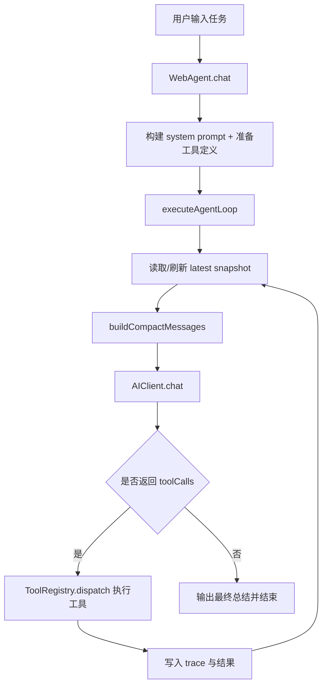
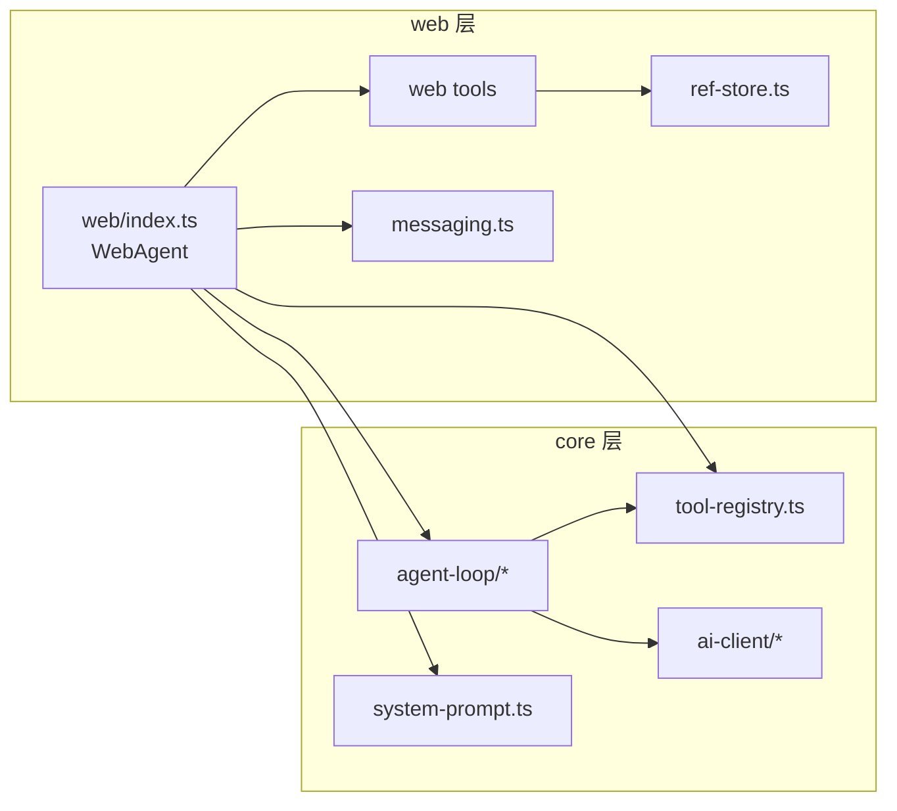
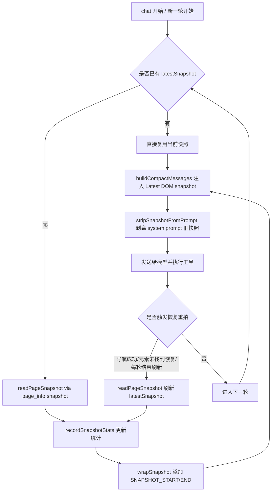

# AutoPilot

> 浏览器内嵌 AI Agent SDK：让 AI 通过 tool-calling 操作网页。

[](LICENSE)

AutoPilot 的目标不是生成文本，而是在浏览器中完成真实任务：点击、填写、导航、等待、执行脚本，并在每一轮根据最新页面状态持续推进。

---

## 项目定位

- 运行环境：浏览器（可扩展到 Chrome Extension）
- 核心机制：快照驱动 + 工具调用 + 增量消费
- 架构分层：
  - `core`：环境无关引擎（Agent Loop、AI Client、Tool Registry）
  - `web`：浏览器能力实现（DOM/导航/快照/等待/执行）

## 优势

- 基于项目路由落地前端级 Agent：
  - Agent 直接运行在真实业务页面，可感知当前路由上下文（列表页、详情页、弹窗页等）
  - 同一套执行循环可在不同路由中持续推进任务，不依赖后端额外编排
- 前端注册 Tools，快速接入复杂工程：
  - 通过 `registerTools()` 和 `registerTool()` 把 DOM 操作、导航、等待、业务动作统一抽象为可调用能力
  - 复杂页面中的“表单 + 下拉 + 弹窗 + 列表 + 路由跳转”可在同一 Agent 流程内组合执行
- 对既有前端工程侵入低：
  - 保持分层边界（`core` 环境无关、`web` 负责浏览器实现），便于在现有项目按需接入
  - 通过快照驱动与工具调用机制，优先复用现有页面结构与交互逻辑

## 企业项目接入建议（3 步）

### 第 1 步：按路由划分 Agent 场景

- 先选 1~2 个高价值页面（如“列表 + 详情 + 创建弹窗”）作为首批接入路由
- 为每个路由定义“可执行动作清单”（查询、筛选、填写、提交、跳转）
- 明确哪些区域需要排除在快照外（如自有 Agent 面板、调试浮层）

### 第 2 步：注册工具并做业务动作封装

- 基础能力先接入内置工具：DOM / navigate / wait / evaluate / page_info
- 再补充业务工具：把常用复杂操作封装成稳定动作（如“创建仓库”“发布任务”）
- 保持工具输入输出稳定：参数尽量结构化，错误码可观测，便于恢复重试

### 第 3 步：上线前做最小闭环验证

- 以真实路由跑通 3 类任务：表单填写、下拉选择、弹窗确认/列表结果校验
- 对关键链路记录指标：工具成功率、恢复次数、快照体积、轮次收敛情况
- 先灰度到内部场景，再逐步扩大覆盖页面与工具范围

---

## 快速开始

### 安装

```bash
pnpm install
```

### 基本使用

```ts
import { WebAgent } from "agentpage";

const agent = new WebAgent({
  token: "your-api-key",
  provider: "deepseek", // openai | copilot | anthropic | deepseek
  model: "deepseek-chat",
  memory: true,
  autoSnapshot: true,
  stream: true,
});

agent.registerTools();

agent.callbacks = {
  onRound: (round) => console.log("round", round + 1),
  onToolCall: (name, input) => console.log("tool", name, input),
  onToolResult: (name, result) => console.log("result", name, result.content),
  onText: (text) => console.log("assistant", text),
};

const result = await agent.chat("打开任务弹窗，填写标题和优先级，然后提交");
console.log(result.reply);
```

### 启动 Demo

```bash
pnpm demo
```

---

## 当前目录结构（权威）

```text
src/
├── core/
│   ├── index.ts
│   ├── types.ts
│   ├── tool-params.ts
│   ├── tool-registry.ts
│   ├── system-prompt.ts
│   ├── agent-loop/
│   │   ├── index.ts
│   │   ├── types.ts
│   │   ├── constants.ts
│   │   ├── helpers.ts
│   │   ├── snapshot.ts
│   │   ├── messages.ts
│   │   └── recovery.ts
│   └── ai-client/
│       ├── index.ts
│       ├── constants.ts
│       ├── custom.ts
│       ├── openai.ts
│       ├── anthropic.ts
│       ├── deepseek.ts
│       └── sse.ts
└── web/
  ├── index.ts
  ├── dom-tool.ts          # 兼容转发层（re-export）
  ├── navigate-tool.ts     # 兼容转发层（re-export）
  ├── page-info-tool.ts    # 兼容转发层（re-export）
  ├── wait-tool.ts         # 兼容转发层（re-export）
  ├── evaluate-tool.ts     # 兼容转发层（re-export）
  ├── ref-store.ts
  ├── messaging.ts
  └── tools/
    ├── dom-tool.ts
    ├── navigate-tool.ts
    ├── page-info-tool.ts
    ├── wait-tool.ts
    └── evaluate-tool.ts
```

---

## 核心原理

### 1) 快照驱动决策

AI 每一轮不是“凭记忆猜页面”，而是基于最新快照选择可执行动作。

可把本轮决策写成一个最小公式：

- 输入：`当前快照 S` + `当前任务描述 R`
- 输出：`当前可执行任务批次 T`（仅包含快照里可见且可操作的目标）

也就是：`S + R -> T`

快照包含：
- 元素标签与关键信息
- hash selector（如 `#a1b2c`）
- 结构化层级关系
- 布局折叠关联标记：当剪枝把同一容器链路中的多个子节点提升到同层时，会用括号分组（`collapsed-group`）标记它们的来源关联

### 2) 任务增量消费

用户任务会被分解成子任务，按轮次逐步“吃掉”：

- 轮次 N：在快照 `S_n` 上执行当前可做任务 `T_n`
- 执行后默认先视为成功，并从当前任务 `R_n` 中剔除 `T_n`
- 得到下一轮任务 `R_(n+1)`，再配合新快照进入下一轮
- 全部剔除完成后结束

任务推进可写成：

- 输入：`当前任务 R_n` + `本轮执行 T_n` + `已执行历史 H_n`
- 输出：`下一轮任务 R_(n+1)`

也就是：`R_n + T_n + H_n -> R_(n+1)`

其中 `R_(n+1)` 就是下一次发给模型的核心输入之一。

新增（渐进式协议）：
- 每轮都会显式携带 `Current remaining instruction`（当前剩余文本）
- 每轮都会携带 `Previous round planned task array`（上一轮执行计划）
- 模型可在文本中返回：
  - `REMAINING: <剩余内容>`：表示还有任务要继续
  - `REMAINING: DONE`：表示剩余任务已空
- 注意：模型在 `tool_calls` 轮可能返回空 `content`；这不代表任务结束。

### 3) 批量但不跨变更链式执行

允许同轮批量执行多个“当前可见目标”的动作；
不允许把“会导致新 DOM 出现”的后续动作强行塞进同轮。

例子：
- 可同轮：同时填写两个已可见输入框
- 不可同轮：点击“打开弹窗”后立即填写弹窗字段（应等下一轮新快照）

---

## 完整对话流程（执行版）

> 目标：每轮都基于“当前快照 + 当前任务”推进，避免 `page_info` 空转。

### 0) chat 触发（前端）

当调用 `WebAgent.chat()` 时，前端会先做一件事：

1. 立即生成首轮快照 `S0`（浏览器端自动完成，不依赖 AI 请求）
2. 将 `S0` 注入到 system prompt
3. 将 `S0` 作为 `initialSnapshot` 传入 loop

这保证了首轮就是“有快照可执行”的状态。

### 1) 每轮输入（给模型）

每轮构建消息时，核心输入固定为：

- `Current remaining instruction`（当前剩余任务）
- `Previous round planned task array`（上一轮已执行任务）
- `Previous round model output (normalized)`（上一轮模型输出归一化摘要）
- `Latest DOM snapshot`（当前快照）

说明：
- Round 0 会携带原始任务文本作为起点；
- Round 1+ 不再重复注入原始 userMessage，避免模型“回头重做”。

### 2) 每轮输出（模型返回）

模型应返回：

- 本轮工具调用批次（能批量就批量）
- 一行剩余任务协议：
  - `REMAINING: <new remaining instruction>`
  - 或 `REMAINING: DONE`

实现细节：
- 若该轮返回 `tool_calls` 且 `content` 为空，loop 仍以“工具执行结果”推进状态，不把空文本当完成信号。

### 3) 每轮执行与状态推进

loop 对本轮返回做以下处理：

1. 执行工具调用批次
2. 拦截 `page_info.*`（在 loop 内视为冗余，不让其成为主流程）
3. 处理恢复（元素找不到时自动刷新快照）
4. 刷新快照进入下一轮
5. 更新下一轮任务文本：
  - 优先使用 `REMAINING`
  - 若缺失 `REMAINING` 且本轮有执行动作：按线性任务剔除做启发式推进（避免整段原任务重复）
  - 若缺失 `REMAINING` 且本轮无执行进展：保持当前任务不推进（按协议回退）
6. 若“remaining 未完成 + 无工具调用”：
  - 不直接结束
  - 下一轮注入 `Protocol violation` 强约束提示，要求“要么给可执行工具调用，要么严格 `REMAINING: DONE`”

### 3.1) 找不到元素重试流（Not-found Retry Dialogue）

当执行工具返回“元素未找到”时，不会直接空转看页面，而是进入重试对话流：

1. 收集失败工具调用（name/input）及失败原因
2. 将“失败工具集合 + 最新快照 + 当前任务”一起发给模型重试
3. 在消息中标注重试次数：`attempt x/y`
4. 若仍未命中，默认 `await 2000ms` 后刷新快照再重试
5. 超过最大尝试次数后退出重试流，交由模型给出剩余任务或结束

默认参数：
- `DEFAULT_NOT_FOUND_RETRY_ROUNDS = 2`
- `DEFAULT_NOT_FOUND_RETRY_WAIT_MS = 2000`

### 4) 停机条件

- 无工具调用且 remaining 已完成（或明确 `REMAINING: DONE`）
- `REMAINING: DONE` 后自然收敛
- 重复批次防自转触发
- 达到 `maxRounds`

### 5) 线性任务剔除示例（标准范式）

总任务：`点击按钮 -> 输入框输入 "abc" -> 发送`

- 第 1 轮
  - 当前任务：`点击按钮 -> 输入框输入 "abc" -> 发送`
  - 上一轮已执行：空
  - 本轮执行：`点击按钮`
  - 下一轮任务：`输入框输入 "abc" -> 发送`

- 第 2 轮
  - 当前任务：`输入框输入 "abc" -> 发送`
  - 上一轮已执行：`点击按钮`
  - 本轮执行：`输入框输入 "abc"`
  - 下一轮任务：`发送`

- 第 3 轮
  - 当前任务：`发送`
  - 上一轮已执行：`点击按钮 -> 输入框输入 "abc"`
  - 本轮执行：`发送`
  - 下一轮任务：`DONE`

核心思想：每轮默认“本轮执行成功”，从当前任务中剔除本轮执行项，得到下一轮任务。

---

## Prompt 设计架构（执行版）

### A. System Prompt（全局规则层）

由 `src/core/system-prompt.ts` 生成，职责是定义不可变执行约束：

- 从当前快照直接执行，不复述任务
- 任务按“剔除模型”推进（current + previous + this-round -> new remaining）
- 禁止 `page_info` 作为规划手段
- 可见目标尽量同轮批量执行
- DOM 会变化的动作执行后在下一轮继续
- 统一输出 `REMAINING` 协议

### B. Round Messages（轮次状态层）

由 `src/core/agent-loop/messages.ts` 构建，职责是把运行时状态传给模型：

- `Current remaining instruction`
- `Done steps (do NOT repeat)`
- `Previous round planned task array`
- `Previous round model output (normalized)`
- `Latest DOM snapshot`

这层是“每轮变化”的动态上下文。

### C. Loop Control（执行控制层）

由 `src/core/agent-loop/index.ts` 负责：

- 首轮使用前端注入的 `initialSnapshot`
- 每轮执行后刷新快照
- 推进 `remainingInstruction`
- `REMAINING` 缺失且本轮有执行动作时：按线性任务剔除做启发式推进
- `REMAINING` 缺失且本轮无执行进展时：保持当前 remaining
- 防空转、防重复、防无限循环
- DOM 变更动作触发强制断轮（等待下一轮新快照）

### D. Recovery & Guard（保护层）

由 `src/core/agent-loop/recovery.ts` 提供：

- 拦截冗余 `page_info` 调用
- 元素未命中自动恢复并刷新快照
- 导航后刷新快照
- 空转检测

由 `src/core/agent-loop/index.ts` 补充：
- not-found 重试对话流（失败工具聚合 + 尝试次数 + 等待重试）

---

## 完整架构流程图（含链路）

### A. 端到端主流程



### B. 分层模块关系



### C. Agent Loop 轮次时序

```mermaid
sequenceDiagram
  participant User as User
  participant Agent as WebAgent
  participant Loop as AgentLoop
  participant AI as AIClient
  participant Tool as ToolRegistry

  User->>Agent: chat(task)
  Agent->>Loop: executeAgentLoop(...)
  loop round 0..max
    Loop->>Loop: read snapshot/context
    Loop->>AI: compact messages + tools
    AI-->>Loop: text/toolCalls
    alt has toolCalls
      Loop->>Tool: dispatch tool calls
      Tool-->>Loop: results
      Loop->>Loop: recovery + refresh snapshot
    else final text
      Loop-->>Agent: final reply
    end
  end
```

---

## Agent Loop 细节

主流程位于 `src/core/agent-loop/index.ts`：

1. 确保当前快照可用
2. 构建紧凑消息（remaining + 执行历史 + 上轮模型输出 + 最新快照）
3. 调用 AI
4. 执行工具调用并记录 trace
5. 运行保护机制
6. 刷新快照并进入下一轮

### 渐进式执行状态（新增）

`src/core/agent-loop/index.ts` 内部维护 5 个关键状态：
- `remainingInstruction`：当前轮次待消费文本（初始值为用户原始输入）
- `previousRoundTasks`：上一轮执行任务数组
- `previousRoundPlannedTasks`：上一轮模型给出的计划批次（执行前）
- `previousRoundModelOutput`：上一轮模型输出归一化摘要（执行后供下轮输入）
- `lastPlannedBatchKey`：用于识别是否连续两轮给出完全相同的任务批次

停机规则：
- 若模型返回无工具调用且 remaining 未完成 → 不直接结束，进入协议修复轮
- 若模型返回无工具调用且 remaining 已完成（或 `REMAINING: DONE`）→ 结束
- 若连续两轮规划出相同任务批次，且上一轮无错误 → 自动终止，防止自转
- 若模型文本包含 `REMAINING: DONE`，通常下一轮会自然进入“无工具调用总结”并结束

### 紧凑消息结构

由 `messages.ts` 构建，核心语义：
- Round 0：用户原始任务 + 首轮快照
- Round 1+：剩余任务 + done steps + 上轮计划批次 + 上轮模型输出归一化 + 最新快照
- Done steps：已完成动作（避免重复）
- Execution context + latest snapshot：当前可执行范围

### 快照生命周期

由 `snapshot.ts` 管理：
- 读取快照
- 包裹快照边界
- 去重历史快照
- 剥离旧 prompt 快照

### 快照读取流程图



---

## 保护机制

由 `recovery.ts` 提供：

- 冗余 `page_info` 拦截：减少无意义工具调用
- 元素找不到恢复：自动等待并刷新快照
- 导航 URL 变化检测：更新上下文，防止旧定位污染
- 空转检测：避免循环无进展
- 重复批次防自转：连续返回同一批任务时自动停止

这些机制直接决定“调用次数、成功率、稳定性”。

---

## AI Client 设计

`src/core/ai-client/` 提供统一接口，内部按 provider 适配：

- `openai.ts`：OpenAI / Copilot 协议
- `anthropic.ts`：Anthropic 协议
- `deepseek.ts`：DeepSeek 协议
- `sse.ts`：流式事件解析

统一输出为 `AIChatResponse`，上层 loop 无需关心 provider 差异。

---

## Web 工具体系

内置 5 个工具（`src/web/*.ts`）：

1. `dom`：点击、填写、输入等交互
2. `navigate`：跳转、前进后退、滚动
3. `page_info`：URL/标题/快照/查询
4. `wait`：等待元素或文本条件
5. `evaluate`：执行页面上下文 JS

通过 `ToolRegistry` 统一暴露给模型，执行结果标准化返回。

### Playwright 对齐说明（当前实现）

- `dom.click`：采用更完整的点击事件链（`pointerdown/mousedown/pointerup/mouseup/click`）。
- `dom.select_option`：支持 `value/label/index`；结果返回显式 `value + label`。
- `dom.fill`：不允许用于 `checkbox/radio/file/button/submit/reset` 等不兼容输入类型。
- `wait.wait_for_selector`：支持 `state=attached|visible|hidden|detached`（默认 `attached`）。
- 快照运行态增强：可见 `select val`、`option selected`、`checked`、`disabled`、`readonly`，减少重复操作。

---

## 扩展与自定义

### 注册自定义工具

```ts
import { Type } from "@sinclair/typebox";

agent.registerTool({
  name: "my_tool",
  description: "业务工具说明",
  schema: Type.Object({
    value: Type.String(),
  }),
  async execute(params) {
    return { content: `ok: ${params.value}` };
  },
});
```

### Chrome Extension 模式

`web/messaging.ts` 提供消息桥：
- Service Worker 发起工具调用
- Content Script 执行 DOM 工具
- 回传结果给后台 Agent

---

## 设计约束（必须遵守）

- `web` 只依赖 `core`，`core` 不依赖 DOM API
- ToolRegistry 必须实例化，禁止全局单例污染
- 工具失败应返回可消费结果，不应直接中断主循环
- 消息策略与系统提示必须一致（否则会增加无效 completion）

---

## 开发命令

```bash
pnpm install
pnpm check
pnpm test
pnpm demo
pnpm build
```

---

## License

MIT
