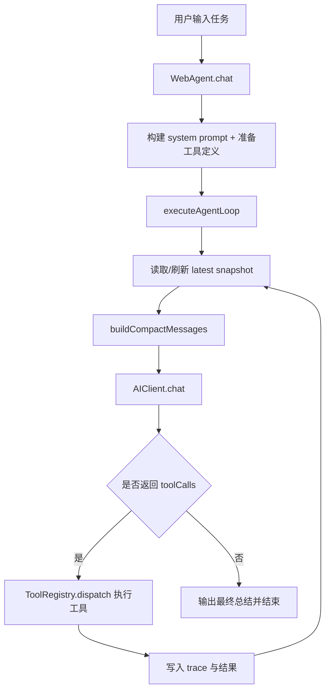
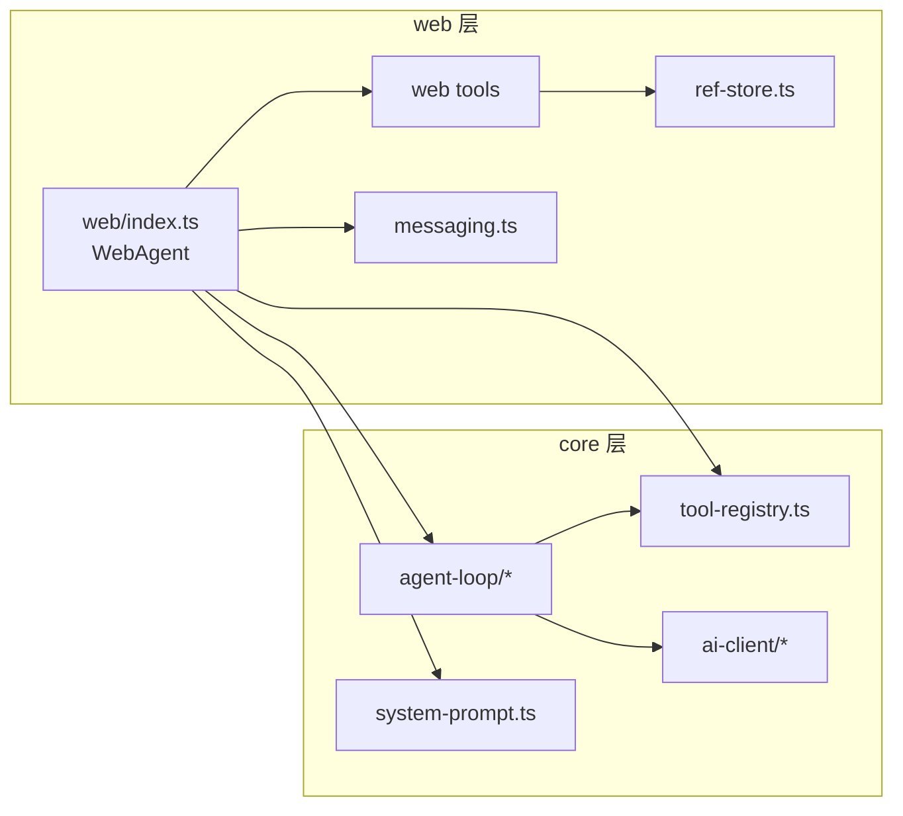

# AutoPilot

> 浏览器内嵌 AI Agent SDK：让 AI 通过 tool-calling 操作网页。

[](LICENSE)

AutoPilot 的目标不是生成文本，而是在浏览器中完成真实任务：点击、填写、导航、等待、执行脚本，并在每一轮根据最新页面状态持续推进。

---

## 项目定位

- 运行环境：浏览器（可扩展到 Chrome Extension）
- 核心机制：快照驱动 + 工具调用 + 增量消费
- 架构分层：
  - `core`：环境无关引擎（Agent Loop、AI Client、Tool Registry）
  - `web`：浏览器能力实现（DOM/导航/快照/等待/执行）

---

## 快速开始

### 安装

```bash
pnpm install
```

### 基本使用

```ts
import { WebAgent } from "agentpage";

const agent = new WebAgent({
  token: "your-api-key",
  provider: "deepseek", // openai | copilot | anthropic | deepseek
  model: "deepseek-chat",
  memory: true,
  autoSnapshot: true,
  stream: true,
});

agent.registerTools();

agent.callbacks = {
  onRound: (round) => console.log("round", round + 1),
  onToolCall: (name, input) => console.log("tool", name, input),
  onToolResult: (name, result) => console.log("result", name, result.content),
  onText: (text) => console.log("assistant", text),
};

const result = await agent.chat("打开任务弹窗，填写标题和优先级，然后提交");
console.log(result.reply);
```

### 启动 Demo

```bash
pnpm demo
```

---

## 当前目录结构（权威）

```text
src/
├── core/
│   ├── index.ts
│   ├── types.ts
│   ├── tool-params.ts
│   ├── tool-registry.ts
│   ├── system-prompt.ts
│   ├── agent-loop/
│   │   ├── index.ts
│   │   ├── types.ts
│   │   ├── constants.ts
│   │   ├── helpers.ts
│   │   ├── snapshot.ts
│   │   ├── messages.ts
│   │   └── recovery.ts
│   └── ai-client/
│       ├── index.ts
│       ├── constants.ts
│       ├── custom.ts
│       ├── openai.ts
│       ├── anthropic.ts
│       ├── deepseek.ts
│       └── sse.ts
└── web/
  ├── index.ts
  ├── dom-tool.ts          # 兼容转发层（re-export）
  ├── navigate-tool.ts     # 兼容转发层（re-export）
  ├── page-info-tool.ts    # 兼容转发层（re-export）
  ├── wait-tool.ts         # 兼容转发层（re-export）
  ├── evaluate-tool.ts     # 兼容转发层（re-export）
  ├── ref-store.ts
  ├── messaging.ts
  └── tools/
    ├── dom-tool.ts
    ├── navigate-tool.ts
    ├── page-info-tool.ts
    ├── wait-tool.ts
    └── evaluate-tool.ts
```

---

## 核心原理

### 1) 快照驱动决策

AI 每一轮不是“凭记忆猜页面”，而是基于最新快照选择可执行动作。

快照包含：
- 元素标签与关键信息
- hash selector（如 `#a1b2c`）
- 结构化层级关系

### 2) 任务增量消费

用户任务会被分解成子任务，按轮次逐步“吃掉”：

- 轮次 N：做当前快照可满足的动作
- 工具执行后刷新快照
- 轮次 N+1：继续做剩余子任务
- 全部完成后返回总结文本

新增（渐进式协议）：
- 每轮都会显式携带 `Current remaining instruction`（当前剩余文本）
- 每轮都会携带 `Previous round planned task array`（上一轮执行计划）
- 模型可在文本中返回：
  - `REMAINING: <剩余内容>`：表示还有任务要继续
  - `REMAINING: DONE`：表示剩余任务已空

### 3) 批量但不跨变更链式执行

允许同轮批量执行多个“当前可见目标”的动作；
不允许把“会导致新 DOM 出现”的后续动作强行塞进同轮。

例子：
- 可同轮：同时填写两个已可见输入框
- 不可同轮：点击“打开弹窗”后立即填写弹窗字段（应等下一轮新快照）

---

## 完整架构流程图（含链路）

### A. 端到端主流程



### B. 分层模块关系



### C. Agent Loop 轮次时序

```mermaid
sequenceDiagram
  participant User as User
  participant Agent as WebAgent
  participant Loop as AgentLoop
  participant AI as AIClient
  participant Tool as ToolRegistry

  User->>Agent: chat(task)
  Agent->>Loop: executeAgentLoop(...)
  loop round 0..max
    Loop->>Loop: read snapshot/context
    Loop->>AI: compact messages + tools
    AI-->>Loop: text/toolCalls
    alt has toolCalls
      Loop->>Tool: dispatch tool calls
      Tool-->>Loop: results
      Loop->>Loop: recovery + refresh snapshot
    else final text
      Loop-->>Agent: final reply
    end
  end
```

---

## Agent Loop 细节

主流程位于 `src/core/agent-loop/index.ts`：

1. 确保当前快照可用
2. 构建紧凑消息（原始目标 + done steps + 最新快照）
3. 调用 AI
4. 执行工具调用并记录 trace
5. 运行保护机制
6. 刷新快照并进入下一轮

### 渐进式执行状态（新增）

`src/core/agent-loop/index.ts` 内部维护 3 个关键状态：
- `remainingInstruction`：当前轮次待消费文本（初始值为用户原始输入）
- `previousRoundTasks`：上一轮执行任务数组
- `lastPlannedBatchKey`：用于识别是否连续两轮给出完全相同的任务批次

停机规则：
- 若模型返回无工具调用 → 直接结束
- 若连续两轮规划出相同任务批次，且上一轮无错误 → 自动终止，防止自转
- 若模型文本包含 `REMAINING: DONE`，通常下一轮会自然进入“无工具调用总结”并结束

### 紧凑消息结构

由 `messages.ts` 构建，核心语义：
- Master goal：用户原始任务（永远保留）
- Done steps：已完成动作（避免重复）
- Execution context + latest snapshot：当前可执行范围

### 快照生命周期

由 `snapshot.ts` 管理：
- 读取快照
- 包裹快照边界
- 去重历史快照
- 剥离旧 prompt 快照

---

## 保护机制

由 `recovery.ts` 提供：

- 冗余 `page_info` 拦截：减少无意义工具调用
- 元素找不到恢复：自动等待并刷新快照
- 导航 URL 变化检测：更新上下文，防止旧定位污染
- 空转检测：避免循环无进展
- 重复批次防自转：连续返回同一批任务时自动停止

这些机制直接决定“调用次数、成功率、稳定性”。

---

## AI Client 设计

`src/core/ai-client/` 提供统一接口，内部按 provider 适配：

- `openai.ts`：OpenAI / Copilot 协议
- `anthropic.ts`：Anthropic 协议
- `deepseek.ts`：DeepSeek 协议
- `sse.ts`：流式事件解析

统一输出为 `AIChatResponse`，上层 loop 无需关心 provider 差异。

---

## Web 工具体系

内置 5 个工具（`src/web/*.ts`）：

1. `dom`：点击、填写、输入等交互
2. `navigate`：跳转、前进后退、滚动
3. `page_info`：URL/标题/快照/查询
4. `wait`：等待元素或文本条件
5. `evaluate`：执行页面上下文 JS

通过 `ToolRegistry` 统一暴露给模型，执行结果标准化返回。

---

## 扩展与自定义

### 注册自定义工具

```ts
import { Type } from "@sinclair/typebox";

agent.registerTool({
  name: "my_tool",
  description: "业务工具说明",
  schema: Type.Object({
    value: Type.String(),
  }),
  async execute(params) {
    return { content: `ok: ${params.value}` };
  },
});
```

### Chrome Extension 模式

`web/messaging.ts` 提供消息桥：
- Service Worker 发起工具调用
- Content Script 执行 DOM 工具
- 回传结果给后台 Agent

---

## 设计约束（必须遵守）

- `web` 只依赖 `core`，`core` 不依赖 DOM API
- ToolRegistry 必须实例化，禁止全局单例污染
- 工具失败应返回可消费结果，不应直接中断主循环
- 消息策略与系统提示必须一致（否则会增加无效 completion）

---

## 开发命令

```bash
pnpm install
pnpm check
pnpm test
pnpm demo
pnpm build
```

---

## License

MIT
