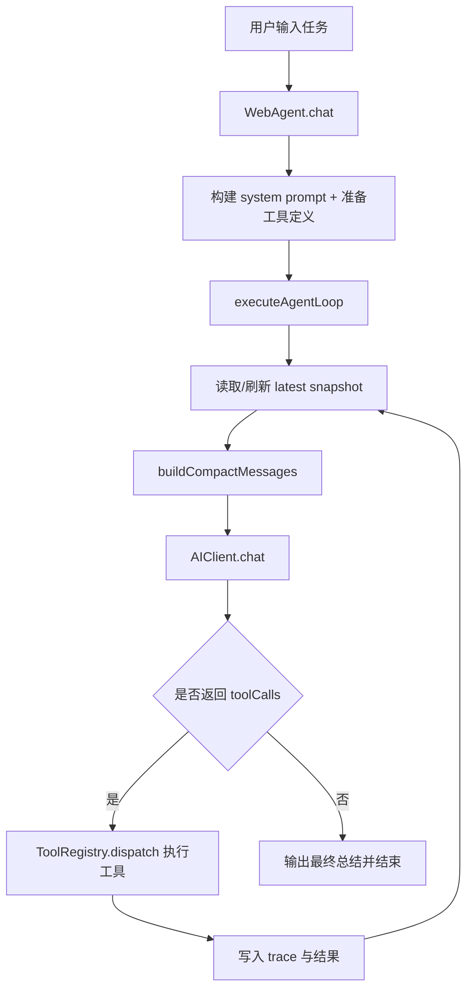
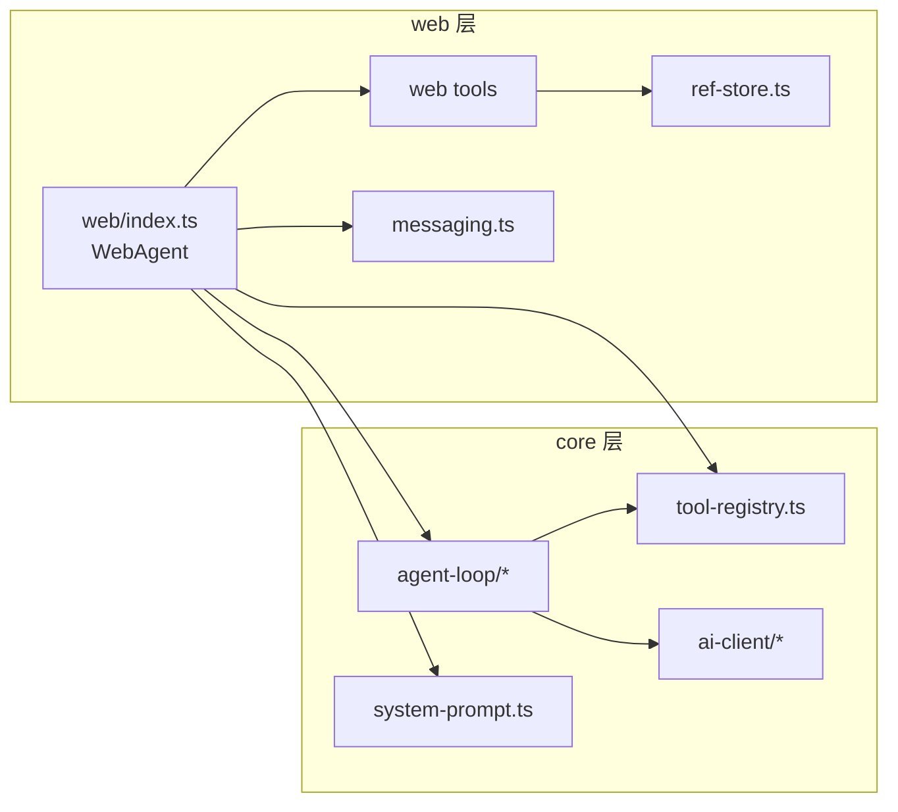
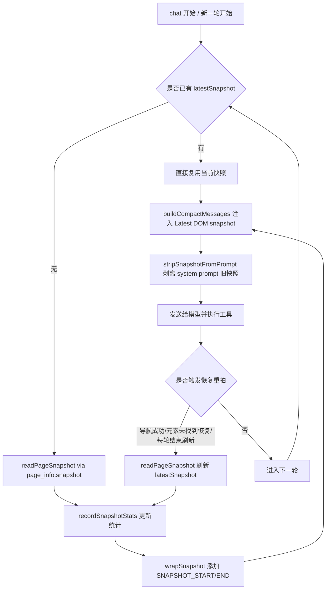

# AutoPilot

<p align="center">
  
</p>

> 浏览器内嵌 AI Agent SDK：让 AI 通过 tool-calling 操作网页。

> 核心主张：通过 **Prompt + Tools + 路由**，快速为网站实现 AI 赋能，并构建**前端运行时 AI Skill**。AutoPilot 本质上是一个运行在前端浏览器中的 AI Agent。

[](LICENSE)

AutoPilot 的目标不是生成文本，而是在浏览器中完成真实任务：点击、填写、导航、等待、执行脚本，并在每一轮根据最新页面状态持续推进。

它的机制可以概括为三句话：

1. **极简、纯原生**：不依赖后端执行引擎，不要求重型中台改造，直接在前端浏览器环境运行。
2. **易集成、低侵入**：可以快速接入各类前端工程，通过少量配置就能落地可执行 Agent。
3. **可编排、可扩展**：通过**用户可自定义的 Prompt 规则** + Tools 注册 + 路由上下文，为网站渐进式构建 AI 能力（即前端运行时 AI Skill）。

AutoPilot 的定位是“**Web 端原生 Agent 补充层**”：在当前行业里，大多数 Agent 仍以“后端服务编排 + API 调用”为主，而真正长期驻留在前端浏览器、直接理解并操作真实页面状态的 Agent 仍然稀缺。AutoPilot 关注的正是这块空白能力。

## README 导航

- 产品定位与价值：为什么是前端原生 AI Agent
- 快速开始：5 分钟集成可运行的 Web Agent
- 路由化落地：通过 Prompt + Tools + 路由构建前端运行时 AI Skill
- 执行机制权威说明：`权威执行文档（v2）`

---

## 项目定位

- 角色定位：作为后端 Agent 的补充，而非替代
- 运行形态：完全运行在浏览器上下文（可扩展到 Chrome Extension）
- 核心机制：快照驱动 + 工具调用 + 增量消费
- 场景目标：让 AI 理解“当前路由能做什么”，并在该上下文内可靠执行
- 产品形态：可作为前端系统的“AI 插件层”，按项目逐步接入、按路由逐步增强
- 架构分层：
  - `core`：环境无关引擎（Agent Loop、AI Client、Tool Registry）
  - `web`：浏览器能力实现（DOM/导航/快照/等待/执行）

## 前端运行时 AI Skill 落地模型

核心公式：

- **Prompt（策略） + Tools（能力） + Route（上下文） = 前端运行时 AI Skill**

三层职责：

1. **Prompt 层（可自定义）**：定义该页面的执行边界、风险约束、输出协议。
2. **Tools 层（可注册）**：定义 AI 在该页面可调用的动作集合（通用 + 业务专用）。
3. **Route 层（运行时上下文）**：告诉 AI 当前在哪个页面、允许做哪些任务、禁做哪些动作。

为什么这个模型对复杂业务有效：

- Prompt 解决“怎么做才安全可靠”。
- Tools 解决“能做什么动作”。
- Route 解决“现在应该做什么”。

因此它非常适合 DevOps/ERP 等高复杂前端系统：可按路由渐进式接入，不需要一次性重构全站。

## 机制亮点：前端运行时 AI Skill

- 核心公式：**Prompt + Tools + 路由 = 前端运行时 AI Skill**。
- 快速赋能路径：先定义路由能力，再配置**用户自定义 Prompt 约束**，最后注册项目级/路由级 Tools。

- 运行完全依赖前端：Agent 在页面运行时直接感知当前 DOM、状态和路由。
- 路由是能力边界：每个路由都可以定义“当前页面可做什么、不能做什么”。
- Prompt 是行为策略：你可以自定义项目级/路由级 Prompt 约束，控制执行风格、风险动作与权限边界。
- Tools 是执行能力：可以注册项目级通用工具，也可以注册路由级专用工具。
- 渐进式赋能：先从高价值路由开始，逐步扩展到全站，形成可维护的 AI Skill 网络。

一句话理解：

- 后端 Agent 负责“全局任务编排”，AutoPilot 负责“前端最后一公里执行”，两者组合可形成完整闭环。

## 为什么是前端原生 Agent

- 传统后端 Agent 更擅长：流程编排、跨系统调用、数据聚合。
- 前端原生 Agent 更擅长：理解当前页面真实状态、直接操作复杂 UI 组件、处理路由内交互细节。
- 两者组合后可形成闭环：
  - 后端负责“全局计划与系统级动作”
  - 前端负责“页面级执行与交互落地”

对 DevOps / ERP 这类复杂系统尤其关键：

- 页面状态复杂（列表、筛选、弹窗、步骤流、权限态）且变化快。
- 纯后端视角很难精确知道“此刻页面上到底可点什么”。
- 前端 Agent 可以基于快照和路由上下文做增量消费，显著减少误操作与空转。

## 优势

- **强调机制价值**：通过 Prompt + Tools + 路由三层组合，可以快速把“可执行 AI 能力”植入现有前端系统。

- 基于项目路由落地前端级 Agent：
  - Agent 直接运行在真实业务页面，可感知当前路由上下文（列表页、详情页、弹窗页等）
  - 同一套执行循环可在不同路由中持续推进任务，不依赖后端额外编排
- 基于路由配置渐进式讲解页面能力：
  - 可按路由注入“页面能力说明”（可查询、可编辑、可提交流程、风险动作等）
  - AI 随路由切换逐步理解系统，不需要一次性学习全站复杂规则
- 前端注册 Tools，快速接入复杂工程：
  - 通过 `registerTools()` 和 `registerTool()` 把 DOM 操作、导航、等待、业务动作统一抽象为可调用能力
  - 支持“项目级工具 + 路由级工具”组合：共性能力复用，特殊页面能力按需挂载
  - 复杂页面中的“表单 + 下拉 + 弹窗 + 列表 + 路由跳转”可在同一 Agent 流程内组合执行
- 对既有前端工程侵入低：
  - 保持分层边界（`core` 环境无关、`web` 负责浏览器实现），便于在现有项目按需接入
  - 通过快照驱动与工具调用机制，优先复用现有页面结构与交互逻辑

## 前景与演进方向

- 从“单页面自动操作”升级到“路由网络级执行助手”：在多个路由间持续消费任务。
- 从“通用工具调用”升级到“业务语义工具层”：把企业关键动作封装成稳定能力。
- 从“单次执行”升级到“可观测闭环”：持续记录成功率、恢复率、收敛轮次，反哺策略优化。
- 与后端 Agent 协同：后端给出全局任务，前端 Agent 负责最后一公里落地执行。

## 企业落地实践（深度说明）

对于企业前端系统（尤其是 DevOps / ERP），真正决定成败的不是“有没有 Agent”，而是是否能在真实路由中稳定收敛。AutoPilot 的价值在于它把落地拆成可持续演进的能力模型，而不是一次性大改造。

在工程实践中，建议围绕三条主线理解和建设：

- **路由主线（业务边界）**：把每个关键路由看作独立能力域。列表页、详情页、弹窗流不是同一种执行上下文，AI 必须在当前路由下决策和执行。
- **Prompt 主线（策略边界）**：Prompt 不是文案，而是运行时策略。你可以按项目与路由自定义约束，定义允许动作、风险动作确认条件、输出协议和禁止区域。
- **Tools 主线（动作边界）**：内置工具负责通用交互，业务工具负责高价值动作封装。把高频复杂流程沉淀成稳定工具，是规模化 AI 赋能的关键。

为什么这种方式能在企业系统里成立：

- 它天然适配渐进式改造：先做高价值路由，再扩展到全站，不阻断原有业务。
- 它天然具备可观测性：每轮工具调用、恢复次数、快照体积、收敛轮次都能被记录和优化。
- 它天然支持协同：后端 Agent 负责全局流程编排，前端 AutoPilot 负责页面级“最后一公里”执行。

最终形态不是“在网页里放一个会聊天的助手”，而是“在前端运行时形成一套可配置、可执行、可演进的 AI Skill 网络”。

---

## 快速开始

### 安装

```bash
pnpm install
```

### 最小可运行示例

```ts
import { WebAgent } from "agentpage";

const agent = new WebAgent({
  token: "your-api-key",
  provider: "doubao", // openai | copilot | anthropic | deepseek | doubao | qwen
  model: "doubao-1.5-pro-32k",
  // 用户可自定义 Prompt 规则（项目级/路由级）
  systemPrompt: "You are an assistant for this route. Follow route safety constraints.",
  memory: true,
  autoSnapshot: true,
  stream: true,
});

agent.registerTools();

agent.callbacks = {
  onRound: (round) => console.log("round", round + 1),
  onToolCall: (name, input) => console.log("tool", name, input),
  onToolResult: (name, result) => console.log("result", name, result.content),
  onText: (text) => console.log("assistant", text),
};

const result = await agent.chat("打开任务弹窗，填写标题和优先级，然后提交");
console.log(result.reply);
```

### 启动 Demo

```bash
pnpm demo
```

### 按路由构建 AI Skill（推荐范式）

```ts
import { WebAgent } from "agentpage";

const agent = new WebAgent({
  token: "your-api-key",
  provider: "deepseek",
  model: "deepseek-chat",
});

agent.registerTools(); // 注册通用工具

type RouteSkillConfig = {
  prompt: string;
  registerRouteTools?: () => void;
};

const routeSkills: Record<string, RouteSkillConfig> = {
  "/tickets": {
    prompt: "You are an assistant for the tickets page. Prioritize filtering, status updates, and safe submit.",
  },
  "/deploy": {
    prompt: "You are an assistant for deployment page. Confirm risky actions before triggering release.",
    registerRouteTools: () => {
      // agent.registerTool(createDeployTool())
    },
  },
};

function applyRouteSkill(pathname: string) {
  const skill = routeSkills[pathname];
  if (!skill) return;
  agent.setSystemPrompt(skill.prompt); // 用户自定义 Prompt
  skill.registerRouteTools?.();        // 路由级 Tools
}

applyRouteSkill(location.pathname);
```

这套模式的价值是：

- 同一个 Agent 内核，在不同路由动态切换“策略 + 能力”。
- 项目可先接入高价值路由，再逐步扩展，形成可维护的 AI Skill 网络。

---

## 配置参数（WebAgentOptions）

创建 `WebAgent` 时可用参数如下：

| 参数 | 类型 | 默认值 | 说明 |
| --- | --- | --- | --- |
| `client` | `AIClient` | - | 自定义 AI 客户端；传入后优先使用该实例，忽略 token/provider/model/baseURL |
| `token` | `string` | `""` | API Token（GitHub PAT / OpenAI API Key / Anthropic Key / DeepSeek Key / Doubao Ark Key / DashScope Key） |
| `provider` | `string` | `"copilot"` | AI 服务商：`copilot` / `openai` / `anthropic` / `deepseek` / `doubao` / `qwen` |
| `model` | `string` | `"gpt-4o"` | 模型名称（需与 provider 匹配，如 `doubao-1.5-pro-32k`、`qwen-plus`、`deepseek-chat`） |
| `baseURL` | `string` | - | 自定义 API 基础地址（用于代理/私有部署，覆盖 provider 默认端点） |
| `stream` | `boolean` | `true` | 是否启用流式返回（SSE）；关闭后使用 JSON 非流式响应 |
| `dryRun` | `boolean` | `false` | 干运行模式：仅输出 AI 计划调用的工具列表，不执行真实操作 |
| `systemPrompt` | `string \| Record<string, string>` | 内置 prompt | 系统提示词注册项：支持单条或 key-value 多条注册（会追加到内置 prompt） |
| `maxRounds` | `number` | `40` | 单次 chat 最大循环轮次，超过后强制终止 |
| `memory` | `boolean` | `false` | 是否开启多轮对话记忆（跨 chat 调用保留历史消息） |
| `autoSnapshot` | `boolean` | `true` | chat 前是否自动生成首轮页面快照并注入 system prompt |
| `snapshotOptions` | `SnapshotOptions` | `{}` | 快照生成参数覆盖（深度、裁剪、剪枝、节点上限等） |
| `roundStabilityWait` | `RoundStabilityWaitOptions` | `{ enabled: true }` | 轮次后稳定等待配置（loading hidden + DOM stable）；`loadingSelectors` 为“与默认值合并去重”，不会覆盖默认列表 |

### 参数详细说明

#### `client`（自定义 AI 客户端）

当你有自己的 AI 后端或需要自定义请求逻辑时，可以传入实现了 `AIClient` 接口的实例：

```ts
import { BaseAIClient } from "agentpage/core";

const customClient = new BaseAIClient({
  chatHandler: async (params) => {
    // 自定义请求逻辑：转发到内部网关、添加鉴权等
    const res = await fetch("/api/ai-proxy", {
      method: "POST",
      body: JSON.stringify(params),
    });
    return res.json();
  },
});

const agent = new WebAgent({ client: customClient });
```

`AIClient` 接口只需实现一个 `chat` 方法：

```ts
type AIClient = {
  chat(params: {
    systemPrompt: string;
    messages: AIMessage[];
    tools?: ToolDefinition[];
  }): Promise<AIChatResponse>;
};
```

#### `provider` 与 `model` 组合

| Provider | 默认端点 | 推荐模型 | 说明 |
| --- | --- | --- | --- |
| `copilot` | GitHub Copilot API | `gpt-4o` | 需要 GitHub PAT |
| `openai` | `https://api.openai.com/v1` | `gpt-4o` / `gpt-4o-mini` | 标准 OpenAI 接口 |
| `anthropic` | `https://api.anthropic.com` | `claude-sonnet-4-20250514` | Anthropic 原生接口 |
| `deepseek` | `https://api.deepseek.com` | `deepseek-chat` | DeepSeek 接口 |
| `doubao` | `https://ark.cn-beijing.volces.com/api/v3` | `doubao-1.5-pro-32k` | 火山引擎 Ark（OpenAI 兼容） |
| `qwen` | `https://dashscope.aliyuncs.com/compatible-mode/v1` | `qwen-plus` | 阿里云百炼兼容模式（OpenAI 兼容） |

#### `systemPrompt`（Prompt 注册与维护）

推荐使用“key-value 注册表”维护 Prompt：

```ts
// 方式 1：初始化时注册单条（默认 key = default）
const agent = new WebAgent({
  systemPrompt: "You are a deployment assistant. Only operate deploy-related UI.",
  // ...
});

// 方式 2：初始化时按 key 批量注册
const routeAgent = new WebAgent({
  systemPrompt: {
    tickets: "You are on tickets page. Prioritize filtering and status updates.",
    deploy: "You are on deploy page. Confirm risky actions before release.",
  },
});

// 方式 3：运行时维护（新增/覆盖/删除/只保留）
agent.setSystemPrompt("tickets", "You are on tickets page. Only operate ticket UI.");
agent.setSystemPrompt("global prompt fallback"); // 写入默认 key: default
agent.removeSystemPrompt("tickets");
agent.keepOnlySystemPrompt("default");
agent.clearSystemPrompts();
console.log(agent.getSystemPrompts());
```

内置 prompt 的核心规则包括：快照优先决策、任务增量消费（REMAINING 协议）、批量执行、禁止 page_info 空转等。注册表中的 Prompt 会作为扩展段追加到内置 prompt 之后。

#### `dryRun`（干运行模式）

开启后，AI 会正常返回工具调用计划，但不会真正执行任何工具。适用于：
- 调试 prompt 效果
- 验证 AI 是否正确理解任务
- 演示 Agent 执行流程

```ts
const agent = new WebAgent({ dryRun: true, /* ... */ });
const result = await agent.chat("填写表单并提交");
// result.reply 中包含 AI 计划调用的工具列表，但不会真正点击/填写
```

#### `memory`（多轮对话记忆）

开启后，每次 `chat()` 调用结束会将本轮消息追加到内部历史中，下次 `chat()` 时自动携带：

```ts
const agent = new WebAgent({ memory: true, /* ... */ });

await agent.chat("打开设置页面");           // 第 1 轮：AI 可看到空历史
await agent.chat("把语言切换成英文");       // 第 2 轮：AI 可看到第 1 轮的上下文
await agent.chat("然后保存设置");           // 第 3 轮：AI 看到前 2 轮的完整上下文

agent.clearHistory();                       // 手动清空历史
```

注意：多轮记忆会增加每次请求的 token 消耗，建议在真正需要跨 chat 上下文时开启。

#### `maxRounds`（最大轮次）

控制单次 `chat()` 的最大循环次数。每一轮包含"构建消息 → 调用 AI → 执行工具 → 刷新快照"完整流水线。

- 简单任务（填写一个表单）：通常 3-8 轮
- 中等任务（多步骤流程）：通常 8-20 轮
- 复杂任务（跨页面操作）：可能需要 20-40 轮

建议：先用默认值 40，观察 `metrics.roundCount` 确定实际轮次分布后再调整。

### 快照参数（snapshotOptions）

| 参数 | 类型 | 默认值 | 说明 |
| --- | --- | --- | --- |
| `maxDepth` | `number` | `8`（chat 首轮）/ `6`（page_info.snapshot） | DOM 最大遍历深度，超过该深度的子树不会输出 |
| `viewportOnly` | `boolean` | `false`（chat 首轮）/ `true`（page_info.snapshot） | 是否仅保留与视口相交的元素 |
| `pruneLayout` | `boolean` | `true` | 是否折叠无意义纯布局容器（div/span/section 等） |
| `maxNodes` | `number` | `500`（chat 首轮）/ `220`（page_info.snapshot） | 快照最大节点输出数量，超出后停止遍历并追加截断提示 |
| `maxChildren` | `number` | `30`（chat 首轮）/ `25`（page_info.snapshot） | 每个父节点最多保留的子元素数量 |
| `maxTextLength` | `number` | `40` | 单节点文本截断长度（字符数） |
| `refStore` | `RefStore` | 自动创建 | hash ID 映射表（一般无需手动传入，WebAgent 自动管理） |

### 快照参数详细说明

#### `maxDepth`（遍历深度）

决定 DOM 树遍历的最大层级。从根元素（`document.body`）到目标元素的嵌套层数。

- 设置过低（如 3-4）：可能遗漏深层嵌套的表单控件或弹窗内容
- 设置过高（如 12+）：快照体积膨胀，浪费 token 且可能包含大量无用结构层
- 推荐值：`6-8`，覆盖大多数组件库嵌套层级

#### `viewportOnly`（视口裁剪）

- `true`：只保留当前可视区域内的元素，完全在视口外的元素跳过
- `false`：保留整个页面所有可见元素，不论是否在视口内

使用建议：
- 首轮快照建议 `false`（避免"元素不存在"误判，完整了解页面结构）
- 后续恢复快照可以用 `true`（减少 token 消耗）
- 长列表页面建议 `true`（避免快照过大）

#### `pruneLayout`（布局折叠）

核心优化策略，可显著减少快照体积：

```
开启前（pruneLayout=false）：                开启后（pruneLayout=true）：
[div]                                        [button] "提交" #abc
  [div]                                      [input] type="text" #def
    [div]
      [button] "提交" #abc
      [input] type="text" #def
```

折叠规则：
- 没有 `id`、没有语义标签（如 `main`/`nav`）、没有交互属性、没有直接文本的纯布局div/span
- 子节点直接**提升**输出到父级位置
- 当同一折叠容器提升出多个相邻节点时，用 `collapsed-group` 括号块标记它们的来源关联

#### `maxNodes`（节点预算）

全局节点输出预算。当已输出节点数达到该值时，停止继续遍历并追加截断提示 `... (truncated, N nodes emitted)`。

- 大型表单页面：建议 300-500
- 简单页面：100-200 即可
- 长列表页面：建议配合 `viewportOnly=true` 使用

#### `maxChildren`（子节点上限）

每个父节点最多输出的子元素数量。超过部分用 `... (N children omitted)` 汇总。

适用于超长列表（如表格的 `tbody` 有数百行），避免快照被重复结构淹没。

#### 首轮快照与后续快照的参数差异

| 场景 | maxDepth | viewportOnly | maxNodes | maxChildren | 原因 |
| --- | --- | --- | --- | --- | --- |
| `chat()` 首轮 | 8 | false | 500 | 30 | 优先完整性，提供充足的页面上下文 |
| `page_info.snapshot`（loop 内） | 8 | false | 500 | 30 | 与首轮对齐，保证一致性 |
| `page_info.snapshot`（手动调用） | 6 | true | 220 | 25 | 较小体积，适合局部更新 |

---

## 运行时 API（完整参考）

### 工具管理

| 方法 | 签名 | 说明 |
| --- | --- | --- |
| `registerTools()` | `(): void` | 注册全部 5 个内置工具（`dom/navigate/page_info/wait/evaluate`） |
| `registerTool(tool)` | `(tool: ToolDefinition): void` | 注册单个自定义工具 |
| `removeTool(name)` | `(name: string): boolean` | 删除工具；若是默认内置工具则返回 `false` |
| `hasTool(name)` | `(name: string): boolean` | 检查工具是否已注册 |
| `getToolNames()` | `(): string[]` | 获取当前已注册的工具名列表 |
| `clearCustomTools()` | `(): string[]` | 删除全部自定义工具并返回被删除工具名；默认内置工具保留 |
| `getTools()` | `(): ToolDefinition[]` | 获取当前已注册的工具定义列表 |

> 默认内置工具保护：通过 `registerTools()` 注册的 `dom/navigate/page_info/wait/evaluate` 不允许删除。

```ts
// 注册所有内置工具
agent.registerTools();

// 注册自定义业务工具
agent.registerTool({
  name: "create_ticket",
  description: "Create a new ticket in the system",
  schema: Type.Object({
    title: Type.String(),
    priority: Type.String({ enum: ["high", "medium", "low"] }),
  }),
  async execute(params) {
    await api.createTicket(params);
    return { content: `Ticket created: ${params.title}` };
  },
});

// 维护工具
console.log(agent.hasTool("create_ticket"));
console.log(agent.getToolNames());
agent.removeTool("create_ticket");
agent.clearCustomTools();
```

### 模型与执行配置

| 方法 | 签名 | 说明 |
| --- | --- | --- |
| `setToken(token)` | `(token: string): void` | 设置 API Token |
| `setClient(client)` | `(client: AIClient \| undefined): void` | 设置自定义客户端（传 undefined 恢复内置） |
| `setProvider(provider)` | `(provider: string): void` | 切换 AI 服务商 |
| `setModel(model)` | `(model: string): void` | 切换模型 |
| `setStream(enabled)` | `(enabled: boolean): void` | 开关流式输出 |
| `getStream()` | `(): boolean` | 获取流式状态 |
| `setDryRun(enabled)` | `(enabled: boolean): void` | 开关干运行模式 |
| `setSystemPrompt(prompt)` | `(prompt: string): void` | 以默认 key(`default`) 注册/覆盖一条 Prompt |
| `setSystemPrompt(key, prompt)` | `(key: string, prompt: string): void` | 按 key 注册/覆盖一条 Prompt |
| `setSystemPrompts(prompts)` | `(prompts: Record<string, string>): void` | 批量注册 Prompt |
| `removeSystemPrompt(key)` | `(key: string): boolean` | 删除指定 key 的 Prompt |
| `keepOnlySystemPrompt(key)` | `(key: string): boolean` | 仅保留指定 key 的 Prompt |
| `getSystemPrompts()` | `(): Record<string, string>` | 获取全部已注册 Prompt（浅拷贝） |
| `clearSystemPrompts()` | `(): void` | 清空全部已注册 Prompt |
| `setMemory(enabled)` | `(enabled: boolean): void` | 开关多轮记忆（关闭时自动清空历史） |
| `getMemory()` | `(): boolean` | 获取记忆状态 |
| `clearHistory()` | `(): void` | 清空对话历史（不影响记忆开关） |
| `setAutoSnapshot(enabled)` | `(enabled: boolean): void` | 开关自动快照 |
| `getAutoSnapshot()` | `(): boolean` | 获取自动快照状态 |
| `setSnapshotOptions(opts)` | `(opts: SnapshotOptions): void` | 设置快照参数 |
| `getSnapshotOptions()` | `(): SnapshotOptions` | 获取当前快照参数（返回浅拷贝） |

### 执行入口

| 方法 | 签名 | 说明 |
| --- | --- | --- |
| `chat(message)` | `(message: string): Promise<AgentLoopResult>` | 执行完整 Agent Loop，返回结果 |

`chat()` 内部完整流程：

1. 创建或复用 AI 客户端实例
2. 构建系统提示词（内置或自定义）
3. 创建本次会话 `RefStore`（hash ID → Element 映射）
4. 生成首轮页面快照并注入到 system prompt
5. 进入 `executeAgentLoop` 循环（消息构建 → AI 调用 → 工具执行 → 快照刷新）
6. 循环结束后返回 `AgentLoopResult`
7. 若开启 memory，将本轮消息追加至历史
8. 清理 RefStore 释放映射

---

## 回调与可观测性

可通过 `agent.callbacks` 订阅执行过程中的每一个关键事件：

| 回调 | 签名 | 触发时机 | 用途 |
| --- | --- | --- | --- |
| `onRound(round)` | `(round: number) => void` | 每轮循环开始 | 展示当前轮次，round 从 0 开始 |
| `onText(text)` | `(text: string) => void` | 模型返回文本输出 | 展示 AI 实时文本（流式/非流式） |
| `onToolCall(name, input)` | `(name: string, input: unknown) => void` | 工具执行前 | 展示 AI 计划调用的工具和参数 |
| `onToolResult(name, result)` | `(name: string, result: ToolCallResult) => void` | 工具执行完成后 | 展示执行结果（成功/失败/恢复） |
| `onSnapshot(snapshot)` | `(snapshot: string) => void` | 自动快照生成后（仅首轮） | 调试快照质量和体积 |
| `onBeforeRecoverySnapshot(newUrl?)` | `(newUrl?: string) => void` | 恢复快照生成前 | 重置路由态/RefStore 映射 |
| `onMetrics(metrics)` | `(metrics: AgentLoopMetrics) => void` | chat() 完整结束后 | 记录 KPI 指标汇总 |

### 回调使用示例

```ts
agent.callbacks = {
  onRound: (round) => {
    console.log(`── 第 ${round + 1} 轮开始 ──`);
  },

  onText: (text) => {
    // 流式展示 AI 输出
    chatPanel.appendText(text);
  },

  onToolCall: (name, input) => {
    // 展示"正在执行..."
    chatPanel.showToolLoading(name, input);
  },

  onToolResult: (name, result) => {
    // 展示执行结果
    const isError = result.details?.error;
    chatPanel.showToolResult(name, result.content, isError);
  },

  onSnapshot: (snapshot) => {
    // 调试：检查快照体积
    console.log(`首轮快照体积: ${snapshot.length} 字符`);
  },

  onBeforeRecoverySnapshot: (newUrl) => {
    if (newUrl) {
      console.log(`页面导航到: ${newUrl}，正在重建快照映射...`);
    } else {
      console.log("元素定位失败，正在刷新快照...");
    }
  },

  onMetrics: (metrics) => {
    // 上报到监控系统
    analytics.track("agent_chat_complete", {
      rounds: metrics.roundCount,
      toolCalls: metrics.totalToolCalls,
      successRate: metrics.toolSuccessRate,
      recoveries: metrics.recoveryCount,
      tokens: metrics.inputTokens + metrics.outputTokens,
    });
  },
};
```

### `onMetrics` 输出字段详解

| 字段 | 类型 | 说明 |
| --- | --- | --- |
| `roundCount` | `number` | 本次 chat 实际执行的轮次数 |
| `totalToolCalls` | `number` | 工具调用总次数（包含被拦截的） |
| `successfulToolCalls` | `number` | 成功执行的工具调用数 |
| `failedToolCalls` | `number` | 失败的工具调用数（包含恢复中的） |
| `toolSuccessRate` | `number` | 工具成功率（0-1，保留 4 位小数） |
| `recoveryCount` | `number` | 元素未找到自动恢复触发次数 |
| `redundantInterceptCount` | `number` | 冗余 page_info 拦截次数（越高说明 prompt 效果越差） |
| `snapshotReadCount` | `number` | 快照读取总次数（含首轮 + 恢复 + 每轮刷新） |
| `latestSnapshotSize` | `number` | 最后一次快照的字符长度 |
| `avgSnapshotSize` | `number` | 平均快照字符长度 |
| `maxSnapshotSize` | `number` | 最大快照字符长度 |
| `inputTokens` | `number` | 累计输入 token 数（所有轮次求和） |
| `outputTokens` | `number` | 累计输出 token 数（所有轮次求和） |

### 健康指标参考

| 指标 | 健康范围 | 警告范围 | 异常范围 | 含义 |
| --- | --- | --- | --- | --- |
| `toolSuccessRate` | > 0.85 | 0.6-0.85 | < 0.6 | 工具执行成功率 |
| `recoveryCount` | 0-2 | 3-5 | > 5 | 元素定位失败恢复次数 |
| `roundCount` | 1-10 | 10-25 | > 25 | 单次任务消耗轮次 |
| `avgSnapshotSize` | 1k-5k | 5k-10k | > 10k | 快照体积（字符数） |
| `redundantInterceptCount` | 0 | 1-3 | > 3 | 无效 page_info 调用被拦截次数 |

---

## 返回结构（AgentLoopResult）

`chat()` 返回一个完整的执行结果对象：

| 字段 | 类型 | 说明 |
| --- | --- | --- |
| `reply` | `string` | AI 最终文本回复（任务完成总结或错误说明） |
| `toolCalls` | `Array<{ name, input, result }>` | 本次所有工具调用的完整轨迹（按执行顺序） |
| `messages` | `AIMessage[]` | 完整对话消息数组（可用于 memory 持续或外部存储） |
| `metrics` | `AgentLoopMetrics` | 本次执行的量化指标 |

### 各字段使用示例

```ts
const result = await agent.chat("填写用户名为 admin 并提交登录");

// 1. 展示最终回复
console.log(result.reply);
// 输出类似："已填写用户名 admin 并点击登录按钮。"

// 2. 审查工具调用轨迹
for (const tc of result.toolCalls) {
  console.log(`${tc.name}(${JSON.stringify(tc.input)}) → ${tc.result.content}`);
}
// 输出类似：
// dom({"action":"fill","selector":"#a1b2c","value":"admin"}) → ✓ 已填写
// dom({"action":"click","selector":"#d3e4f"}) → ✓ 已点击

// 3. 检查执行指标
console.log(`总轮次: ${result.metrics.roundCount}`);
console.log(`工具调用: ${result.metrics.totalToolCalls}`);
console.log(`成功率: ${result.metrics.toolSuccessRate}`);
console.log(`Token 消耗: ${result.metrics.inputTokens + result.metrics.outputTokens}`);

// 4. 存储消息用于后续分析
localStorage.setItem("last_chat_messages", JSON.stringify(result.messages));
```

### ToolCallResult 结构

每个工具调用返回标准化结构：

```ts
type ToolCallResult = {
  content: string | Record<string, unknown>;   // 返回内容（发给 AI）
  details?: Record<string, unknown>;           // 额外细节（日志/调试用）
};
```

`details` 中的关键字段：

| 字段 | 出现条件 | 含义 |
| --- | --- | --- |
| `error: true` | 工具执行失败时 | 标记这是一个错误结果 |
| `code` | 有特定错误类型时 | 错误码（见下方错误码表） |
| `action` | DOM/导航等工具 | 执行的具体动作 |
| `selector` | DOM 工具 | 目标元素选择器 |
| `recoveryAttempt` | 恢复机制触发时 | 当前恢复次数 |

### 错误码速查

| 错误码 | 触发来源 | 含义 |
| --- | --- | --- |
| `ELEMENT_NOT_FOUND` | dom-tool | hash ID / CSS 选择器未命中元素 |
| `ELEMENT_NOT_VISIBLE` | dom-tool | 元素存在但不可见 |
| `ELEMENT_DISABLED` | dom-tool | 元素被禁用（disabled / aria-disabled） |
| `ELEMENT_DETACHED` | dom-tool | 元素已脱离 DOM 树 |
| `UNSUPPORTED_FILL_TARGET` | dom-tool | 目标不可编辑（如 div 或 checkbox） |
| `ELEMENT_NOT_FOUND_RECOVERY` | recovery | 恢复中：已刷新快照，等待重试 |
| `ELEMENT_NOT_FOUND_MAX_RECOVERY_REACHED` | recovery | 恢复次数用尽 |
| `REDUNDANT_PAGE_INFO_SKIPPED` | recovery | page_info 调用被拦截为冗余 |
| `REDUNDANT_SNAPSHOT` | recovery | 连续重复快照被标记 |

---

## 内置工具详细参考

AutoPilot 内置 5 个工具，覆盖浏览器交互的核心能力。所有工具通过 `ToolRegistry` 统一注册和分发。

### `dom`（DOM 交互工具）

最核心的工具，负责所有页面元素交互操作。

**参数说明：**

| 参数 | 类型 | 必需 | 说明 |
| --- | --- | --- | --- |
| `action` | `string` | ✅ | 操作类型（见下方动作表） |
| `selector` | `string` | ✅ | 元素选择器（hash ID 如 `#a1b2c` 或 CSS 选择器） |
| `value` | `string` | 部分动作 | 填写值（fill/type/set_attr/add_class/remove_class） |
| `key` | `string` | press | 按键名称（如 `Enter`、`Control+a`） |
| `label` | `string` | select_option | 选项显示文本 |
| `index` | `number` | select_option | 选项索引 |
| `attribute` | `string` | get_attr/set_attr | 属性名称 |
| `className` | `string` | add_class/remove_class | CSS 类名（旧参数名，已被 `value` 兼容） |
| `clickCount` | `number` | click | 点击次数（默认 1，双击传 2，三击传 3） |
| `waitMs` | `number` | 所有动作 | 等待元素出现的超时时间（毫秒，默认 1200） |
| `waitSeconds` | `number` | 所有动作 | 等待超时（秒，`waitMs` 优先级更高） |
| `force` | `boolean` | 所有动作 | 跳过 actionability 检查（默认 false） |

**动作详解：**

| 动作 | 说明 | 示例参数 |
| --- | --- | --- |
| `click` | 点击元素（完整事件链） | `{ action: "click", selector: "#btn" }` |
| `fill` | 填写输入框（清空后写入） | `{ action: "fill", selector: "#name", value: "张三" }` |
| `type` | 逐字输入（不清空已有内容） | `{ action: "type", selector: "#search", value: "keyword" }` |
| `press` | 按键（支持组合键） | `{ action: "press", selector: "#input", key: "Enter" }` |
| `select_option` | 选择下拉选项 | `{ action: "select_option", selector: "#sel", value: "opt1" }` |
| `check` | 勾选 checkbox | `{ action: "check", selector: "#agree" }` |
| `uncheck` | 取消勾选 | `{ action: "uncheck", selector: "#agree" }` |
| `clear` | 清空输入框 | `{ action: "clear", selector: "#name" }` |
| `focus` | 聚焦元素 | `{ action: "focus", selector: "#input" }` |
| `hover` | 鼠标悬停 | `{ action: "hover", selector: "#menu" }` |
| `get_text` | 获取元素文本 | `{ action: "get_text", selector: "#title" }` |
| `get_attr` | 获取属性值 | `{ action: "get_attr", selector: "#el", attribute: "href" }` |
| `set_attr` | 设置属性值 | `{ action: "set_attr", selector: "#el", attribute: "data-id", value: "1" }` |
| `add_class` | 添加 CSS 类 | `{ action: "add_class", selector: "#el", value: "active" }` |
| `remove_class` | 移除 CSS 类 | `{ action: "remove_class", selector: "#el", value: "active" }` |

**关键行为机制（Playwright 风格）：**

1. **Actionability 检查**（默认开启，`force=true` 可跳过）：
   - 可见性：元素 `display` 不为 `none`、`visibility` 为 `visible`、`opacity` 不为 `0`、宽高大于 0
   - 稳定性：通过 `requestAnimationFrame` 连续 3 帧检测元素位置不变
   - 可用性：检查 `disabled` 属性和祖先链 `aria-disabled`
   - 可编辑性：`fill`/`type`/`clear` 需要目标是可编辑元素
   - 遮挡检测：`elementFromPoint` 检查元素中心是否被其他元素覆盖

2. **点击事件链**（完整 Pointer/Mouse 序列）：
   ```
   pointermove → mousemove → pointerdown → mousedown → focus → pointerup → mouseup → click
   ```
   - 每个事件都带有正确的坐标（元素中心点）和 button/buttons 属性
   - 支持多次点击（clickCount=2 双击、clickCount=3 三击）

3. **智能重定向（retarget）**：
   - `click`：非交互元素自动查找最近的 `button/[role=button]/a/[role=link]`
   - `follow-label`：`<label>` 元素自动重定向到 `label.control`
   - 隐藏控件代理：Element Plus/AntD 等组件库的隐藏 checkbox/radio/switch，自动重定向到可见的代理元素（`.el-switch`、`.el-checkbox` 等）
   - 表单项 label 映射：点击 `.el-form-item__label` 自动定位到同一 form-item 内的实际控件

4. **fill 分类型处理**：
   - `date/color/range/time/month/week`：通过原生 `value` setter 直接写入
   - `text/email/password/search/url/tel/number`：`selectAll` + 原生写入 + 事件派发
   - `textarea`/`contenteditable`：同上
   - **禁止类型**：`checkbox/radio/file/button/submit/reset/image`

5. **select_option 三策略**：
   - 优先 `value` 匹配 → 其次 `label` 文本匹配 → 最后 `index` 索引
   - 原生 `<select>` 和自定义下拉组件（Element Plus/AntD）都有增强处理
   - 返回明确的 `selected value + label`

6. **press 组合键**：
   - 支持 `Control+a`、`Shift+Enter`、`Meta+c` 等
   - 修饰键通过 `keydown → keyup` 事件链实现

7. **scrollIntoView 多策略轮换**：
   - 策略 0：`scrollIntoViewIfNeeded(true)`（Chrome 私有 API）
   - 策略 1：`scrollIntoView({ block: "end", inline: "end" })`
   - 策略 2：`scrollIntoView({ block: "center", inline: "center" })`
   - 策略 3：`scrollIntoView({ block: "start", inline: "start" })`
   - 当 hit-target 检测到遮挡时，自动轮换策略重试

8. **get_attr 运行态增强**：
   - `checked`：读取 DOM property 而非 HTML attribute（适配动态状态）
   - `selected`：读取 `<option>` 的 `selected` property
   - `disabled`/`readonly`：读取 DOM property
   - `value`：读取当前输入值（property）而非初始 HTML attribute

### `navigate`（页面导航工具）

**参数说明：**

| 参数 | 类型 | 必需 | 说明 |
| --- | --- | --- | --- |
| `action` | `string` | ✅ | 导航动作类型 |
| `url` | `string` | goto | 目标 URL（`goto` 动作必需） |
| `selector` | `string` | scroll | 滚动目标（hash ID 或 CSS 选择器） |
| `x` | `number` | scroll | 水平滚动位置（像素） |
| `y` | `number` | scroll | 垂直滚动位置（像素） |

**动作详解：**

| 动作 | 说明 | 行为 |
| --- | --- | --- |
| `goto` | 跳转到指定 URL | `window.location.href = url`，触发导航后自动刷新快照 |
| `back` | 浏览器后退 | `window.history.back()`，触发后自动刷新快照 |
| `forward` | 浏览器前进 | `window.history.forward()`，触发后自动刷新快照 |
| `reload` | 刷新页面 | `window.location.reload()`，触发后自动刷新快照 |
| `scroll` | 滚动到指定位置/元素 | 优先 `scrollIntoViewIfNeeded`，回退 `scrollIntoView(center)` |

**注意事项：**
- `goto/back/forward/reload` 执行后会触发**强制断轮**，等待下一轮新快照
- `scroll.selector` 支持 RefStore hash ID 和 CSS 选择器

### `wait`（等待工具）

**参数说明：**

| 参数 | 类型 | 必需 | 说明 |
| --- | --- | --- | --- |
| `action` | `string` | ✅ | 等待动作类型 |
| `selector` | `string` | wait_for_selector/hidden | 目标元素选择器 |
| `state` | `string` | wait_for_selector | 目标状态：`attached`/`visible`/`hidden`/`detached` |
| `text` | `string` | wait_for_text | 要等待出现的文本内容 |
| `timeout` | `number` | 所有动作 | 超时时间（毫秒，默认 6000） |
| `quietMs` | `number` | wait_for_stable | DOM 静默窗口时长（毫秒，默认 300） |

**动作详解：**

| 动作 | 说明 | 实现策略 |
| --- | --- | --- |
| `wait_for_selector` | 等待选择器达到指定状态 | 轮询(80ms) + MutationObserver 双通道 |
| `wait_for_hidden` | 等待元素隐藏或移除 | 等同 `wait_for_selector(state=hidden)` |
| `wait_for_text` | 等待页面出现指定文本 | 轮询(80ms) + MutationObserver(characterData) |
| `wait_for_stable` | 等待 DOM 进入静默窗口 | MutationObserver 监听变化，无变化持续 quietMs 则完成 |

**状态语义（wait_for_selector）：**

| state | 含义 | 完成条件 |
| --- | --- | --- |
| `attached`（默认） | 元素存在于 DOM 树 | `querySelector` 命中 |
| `visible` | 元素可见 | 存在且 `display/visibility/opacity/size` 均正常 |
| `hidden` | 元素不可见或不存在 | 不存在或存在但不可见 |
| `detached` | 元素从 DOM 树移除 | `querySelector` 未命中 |

**双通道检测策略：**
- **轮询通道**：每 80ms 主动检查一次目标状态
- **MutationObserver 通道**：监听 DOM 变化事件，变化发生时立即检查
- 双通道确保"快速响应变化 + 不遗漏非 DOM 触发的状态变化"

### `page_info`（页面信息工具）

**参数说明：**

| 参数 | 类型 | 必需 | 说明 |
| --- | --- | --- | --- |
| `action` | `string` | ✅ | 信息获取动作类型 |
| `selector` | `string` | query_all | CSS 选择器（用于 `query_all` 动作） |
| `maxDepth` | `number` | snapshot | 最大遍历深度（默认 6） |
| `viewportOnly` | `boolean` | snapshot | 是否仅保留视口内元素（默认 true） |
| `pruneLayout` | `boolean` | snapshot | 是否折叠布局容器（默认 true） |
| `maxNodes` | `number` | snapshot | 最大节点数（默认 220） |
| `maxChildren` | `number` | snapshot | 每个父节点最大子节点数（默认 25） |
| `maxTextLength` | `number` | snapshot | 文本截断长度（默认 40） |

**动作详解：**

| 动作 | 返回内容 |
| --- | --- |
| `get_url` | 当前页面 URL 字符串 |
| `get_title` | 当前页面标题 |
| `get_selection` | 用户当前选中的文本 |
| `get_viewport` | 视口宽高和滚动位置（JSON） |
| `snapshot` | DOM 结构快照（AI 可读文本格式） |
| `query_all` | 匹配选择器的所有元素摘要 |

**重要：** 在 Agent Loop 内，`page_info` 的大多数动作会被 recovery 模块拦截为冗余（因为框架每轮已自动提供最新快照）。AI 不需要也不应该主动调用这些动作。

### `evaluate`（JavaScript 执行工具）

**参数说明：**

| 参数 | 类型 | 必需 | 说明 |
| --- | --- | --- | --- |
| `expression` | `string` | ✅ | JavaScript 表达式或语句块 |

**行为细节：**

- 使用 `new Function("use strict"; ...)` 执行（不污染当前作用域）
- 优先作为表达式求值（`return (expression)`）
- 若表达式失败，回退为语句块执行（`expression`）
- 结果序列化：
  - DOM 元素 → `<tag#id> "textContent"`
  - NodeList/HTMLCollection → 逐个序列化
  - 普通值 → `JSON.stringify`
  - 错误 → 返回错误信息

**使用建议：**

```ts
// ✅ 适合：其他工具无法覆盖的场景
{ expression: "document.querySelector('.modal').style.display = 'none'" }
{ expression: "window.scrollTo(0, document.body.scrollHeight)" }

// ❌ 避免：有专用工具的场景
// 用 dom.click 代替手动派发 click 事件
// 用 navigate.goto 代替 window.location.href = ...
```

**安全注意：** `evaluate` 是最强大也是最危险的工具。建议在 Prompt 中明确约束使用条件。

---

## 设计思想（Design Philosophy）

AutoPilot 的设计不是“做一个会聊天的前端插件”，而是建立一个可执行、可约束、可演进的前端 Agent 运行时。

### 1) 快照优先，不猜页面

- 每轮只基于最新快照做决策，避免“记忆幻觉”。
- 快照本身是事实边界，工具调用是行为边界。

### 2) 渐进式任务消费，不一次性硬做完

- 通过 `REMAINING` 协议持续收敛任务。
- 每轮完成一批当前可执行动作，逐轮推进直至 `DONE`。

### 3) Prompt + Tools + 路由 三层解耦

- Prompt 决定策略
- Tools 决定动作
- 路由决定上下文

这三层解耦让企业系统能够低风险增量接入，而不是一次性重构。

### 4) 保护机制优先于“盲目追求一步到位”

- 冗余拦截、找不到元素恢复、重试对话流、空转终止、防自转停机。
- 目标是稳定收敛，而不是偶然成功。

### 5) 对后端 Agent 互补，而非替代

- 后端 Agent 擅长跨系统编排。
- 前端 AutoPilot 擅长页面级执行。
- 两者组合形成完整企业 AI 执行闭环。

---

## 当前目录结构（权威）

```text
src/
├── core/
│   ├── index.ts
│   ├── types.ts
│   ├── tool-params.ts
│   ├── tool-registry.ts
│   ├── system-prompt.ts
│   ├── agent-loop/
│   │   ├── index.ts
│   │   ├── types.ts
│   │   ├── constants.ts
│   │   ├── helpers.ts
│   │   ├── snapshot.ts
│   │   ├── messages.ts
│   │   └── recovery.ts
│   └── ai-client/
│       ├── index.ts
│       ├── constants.ts
│       ├── custom.ts
│       ├── openai.ts
│       ├── anthropic.ts
│       ├── deepseek.ts
│       └── sse.ts
└── web/
  ├── index.ts
  ├── dom-tool.ts          # 兼容转发层（re-export）
  ├── navigate-tool.ts     # 兼容转发层（re-export）
  ├── page-info-tool.ts    # 兼容转发层（re-export）
  ├── wait-tool.ts         # 兼容转发层（re-export）
  ├── evaluate-tool.ts     # 兼容转发层（re-export）
  ├── ref-store.ts
  ├── messaging.ts
  └── tools/
    ├── dom-tool.ts
    ├── navigate-tool.ts
    ├── page-info-tool.ts
    ├── wait-tool.ts
    └── evaluate-tool.ts
```

---

## 核心原理

### 1) 快照驱动决策

AI 每一轮不是“凭记忆猜页面”，而是基于最新快照选择可执行动作。

可把本轮决策写成一个最小公式：

- 输入：`当前快照 S` + `当前任务描述 R`
- 输出：`当前可执行任务批次 T`（仅包含快照里可见且可操作的目标）

也就是：`S + R -> T`

快照包含：
- 元素标签与关键信息
- hash selector（如 `#a1b2c`）
- 结构化层级关系
- 布局折叠关联标记：当剪枝把同一容器链路中的多个子节点提升到同层时，会用括号分组（`collapsed-group`）标记它们的来源关联

### 2) 任务增量消费

用户任务会被分解成子任务，按轮次逐步“吃掉”：

- 轮次 N：在快照 `S_n` 上执行当前可做任务 `T_n`
- 执行后默认先视为成功，并从当前任务 `R_n` 中剔除 `T_n`
- 得到下一轮任务 `R_(n+1)`，再配合新快照进入下一轮
- 全部剔除完成后结束

任务推进可写成：

- 输入：`当前任务 R_n` + `本轮执行 T_n` + `已执行历史 H_n`
- 输出：`下一轮任务 R_(n+1)`

也就是：`R_n + T_n + H_n -> R_(n+1)`

其中 `R_(n+1)` 就是下一次发给模型的核心输入之一。

新增（渐进式协议）：
- 每轮都会显式携带 `Current remaining instruction`（当前剩余文本）
- 每轮都会携带 `Previous round planned task array`（上一轮执行计划）
- 模型可在文本中返回：
  - `REMAINING: <剩余内容>`：表示还有任务要继续
  - `REMAINING: DONE`：表示剩余任务已空
- 注意：模型在 `tool_calls` 轮可能返回空 `content`；这不代表任务结束。

### 3) 批量但不跨变更链式执行

允许同轮批量执行多个“当前可见目标”的动作；
不允许把“会导致新 DOM 出现”的后续动作强行塞进同轮。

例子：
- 可同轮：同时填写两个已可见输入框
- 不可同轮：点击“打开弹窗”后立即填写弹窗字段（应等下一轮新快照）
- 当前实现：若本轮出现潜在 DOM 变化动作，轮次结束会自动执行双重等待（先 loading hidden，再 DOM quiet window），默认 `quietMs=200`、`timeoutMs=4000`。
- `loadingSelectors` 默认内置 AntD / Element Plus / BK / TDesign（TD）及通用加载态选择器；用户自定义会在默认列表基础上追加并去重，不会覆盖默认值。

---

## 完整对话流程（执行版）

> 目标：每轮都基于“当前快照 + 当前任务”推进，避免 `page_info` 空转。

### 0) chat 触发（前端）

当调用 `WebAgent.chat()` 时，前端会先做一件事：

1. 立即生成首轮快照 `S0`（浏览器端自动完成，不依赖 AI 请求）
2. 将 `S0` 注入到 system prompt
3. 将 `S0` 作为 `initialSnapshot` 传入 loop

这保证了首轮就是“有快照可执行”的状态。

### 1) 每轮输入（给模型）

每轮构建消息时，核心输入固定为：

- `Current remaining instruction`（当前剩余任务）
- `Previous round planned task array`（上一轮已执行任务）
- `Previous round model output (normalized)`（上一轮模型输出归一化摘要）
- `Latest DOM snapshot`（当前快照）

说明：
- Round 0 会携带原始任务文本作为起点；
- Round 1+ 不再重复注入原始 userMessage，避免模型“回头重做”。

### 2) 每轮输出（模型返回）

模型应返回：

- 本轮工具调用批次（能批量就批量）
- 一行剩余任务协议：
  - `REMAINING: <new remaining instruction>`
  - 或 `REMAINING: DONE`

实现细节：
- 若该轮返回 `tool_calls` 且 `content` 为空，loop 仍以“工具执行结果”推进状态，不把空文本当完成信号。

### 3) 每轮执行与状态推进

loop 对本轮返回做以下处理：

1. 执行工具调用批次
2. 拦截 `page_info.*`（在 loop 内视为冗余，不让其成为主流程）
3. 处理恢复（元素找不到时自动刷新快照）
4. 若本轮存在潜在 DOM 变化动作：执行轮次后稳定等待（loading hidden + DOM stable）
5. 刷新快照进入下一轮
6. 更新下一轮任务文本：
  - 优先使用 `REMAINING`
  - 若缺失 `REMAINING` 且本轮有执行动作：按线性任务剔除做启发式推进（避免整段原任务重复）
  - 若缺失 `REMAINING` 且本轮无执行进展：保持当前任务不推进（按协议回退）
7. 若“remaining 未完成 + 无工具调用”：
  - 不直接结束
  - 下一轮注入 `Protocol violation` 强约束提示，要求“要么给可执行工具调用，要么严格 `REMAINING: DONE`”

### 3.1) 找不到元素重试流（Not-found Retry Dialogue）

当执行工具返回“元素未找到”时，不会直接空转看页面，而是进入重试对话流：

1. 收集失败工具调用（name/input）及失败原因
2. 将“失败工具集合 + 最新快照 + 当前任务”一起发给模型重试
3. 在消息中标注重试次数：`attempt x/y`
4. 若仍未命中，默认 `await 1000ms` 后刷新快照再重试
5. 超过最大尝试次数后退出重试流，交由模型给出剩余任务或结束

默认参数：
- `DEFAULT_NOT_FOUND_RETRY_ROUNDS = 2`
- `DEFAULT_NOT_FOUND_RETRY_WAIT_MS = 1000`

### 4) 停机条件

- 无工具调用且 remaining 已完成（或明确 `REMAINING: DONE`）
- `REMAINING: DONE` 后自然收敛
- 重复批次防自转触发
- 达到 `maxRounds`

### 5) 线性任务剔除示例（标准范式）

总任务：`点击按钮 -> 输入框输入 "abc" -> 发送`

- 第 1 轮
  - 当前任务：`点击按钮 -> 输入框输入 "abc" -> 发送`
  - 上一轮已执行：空
  - 本轮执行：`点击按钮`
  - 下一轮任务：`输入框输入 "abc" -> 发送`

- 第 2 轮
  - 当前任务：`输入框输入 "abc" -> 发送`
  - 上一轮已执行：`点击按钮`
  - 本轮执行：`输入框输入 "abc"`
  - 下一轮任务：`发送`

- 第 3 轮
  - 当前任务：`发送`
  - 上一轮已执行：`点击按钮 -> 输入框输入 "abc"`
  - 本轮执行：`发送`
  - 下一轮任务：`DONE`

核心思想：每轮默认“本轮执行成功”，从当前任务中剔除本轮执行项，得到下一轮任务。

---

## Prompt 设计架构（执行版）

### A. System Prompt（全局规则层）

由 `src/core/system-prompt.ts` 生成，职责是定义不可变执行约束：

- 从当前快照直接执行，不复述任务
- 任务按“剔除模型”推进（current + previous + this-round -> new remaining）
- 禁止 `page_info` 作为规划手段
- 可见目标尽量同轮批量执行
- DOM 会变化的动作执行后在下一轮继续
- 统一输出 `REMAINING` 协议

### B. Round Messages（轮次状态层）

由 `src/core/agent-loop/messages.ts` 构建，职责是把运行时状态传给模型：

- `Current remaining instruction`
- `Done steps (do NOT repeat)`
- `Previous round planned task array`
- `Previous round model output (normalized)`
- `Latest DOM snapshot`

这层是“每轮变化”的动态上下文。

### C. Loop Control（执行控制层）

由 `src/core/agent-loop/index.ts` 负责：

- 首轮使用前端注入的 `initialSnapshot`
- 每轮执行后刷新快照
- 推进 `remainingInstruction`
- `REMAINING` 缺失且本轮有执行动作时：按线性任务剔除做启发式推进
- `REMAINING` 缺失且本轮无执行进展时：保持当前 remaining
- 防空转、防重复、防无限循环
- DOM 变更动作触发强制断轮（等待下一轮新快照）

### D. Recovery & Guard（保护层）

由 `src/core/agent-loop/recovery.ts` 提供：

- 拦截冗余 `page_info` 调用
- 元素未命中自动恢复并刷新快照
- 导航后刷新快照
- 空转检测

由 `src/core/agent-loop/index.ts` 补充：
- not-found 重试对话流（失败工具聚合 + 尝试次数 + 等待重试）

---

## 完整架构流程图（含链路）

### A. 端到端主流程



### B. 分层模块关系



### C. Agent Loop 轮次时序

```mermaid
sequenceDiagram
  participant User as User
  participant Agent as WebAgent
  participant Loop as AgentLoop
  participant AI as AIClient
  participant Tool as ToolRegistry

  User->>Agent: chat(task)
  Agent->>Loop: executeAgentLoop(...)
  loop round 0..max
    Loop->>Loop: read snapshot/context
    Loop->>AI: compact messages + tools
    AI-->>Loop: text/toolCalls
    alt has toolCalls
      Loop->>Tool: dispatch tool calls
      Tool-->>Loop: results
      Loop->>Loop: recovery + refresh snapshot
    else final text
      Loop-->>Agent: final reply
    end
  end
```

---

## Agent Loop 细节

主流程位于 `src/core/agent-loop/index.ts`：

1. 确保当前快照可用
2. 构建紧凑消息（remaining + 执行历史 + 上轮模型输出 + 最新快照）
3. 调用 AI
4. 执行工具调用并记录 trace
5. 运行保护机制
6. 刷新快照并进入下一轮

### 渐进式执行状态（新增）

`src/core/agent-loop/index.ts` 内部维护 5 个关键状态：
- `remainingInstruction`：当前轮次待消费文本（初始值为用户原始输入）
- `previousRoundTasks`：上一轮执行任务数组
- `previousRoundPlannedTasks`：上一轮模型给出的计划批次（执行前）
- `previousRoundModelOutput`：上一轮模型输出归一化摘要（执行后供下轮输入）
- `lastPlannedBatchKey`：用于识别是否连续两轮给出完全相同的任务批次

停机规则：
- 若模型返回无工具调用且 remaining 未完成 → 不直接结束，进入协议修复轮
- 若模型返回无工具调用且 remaining 已完成（或 `REMAINING: DONE`）→ 结束
- 若连续两轮规划出相同任务批次，且上一轮无错误 → 自动终止，防止自转
- 若模型文本包含 `REMAINING: DONE`，通常下一轮会自然进入“无工具调用总结”并结束

### 紧凑消息结构

由 `messages.ts` 构建，核心语义：
- Round 0：用户原始任务 + 首轮快照
- Round 1+：剩余任务 + done steps + 上轮计划批次 + 上轮模型输出归一化 + 最新快照
- Done steps：已完成动作（避免重复）
- Execution context + latest snapshot：当前可执行范围

### 快照生命周期

由 `snapshot.ts` 管理：
- 读取快照
- 包裹快照边界
- 去重历史快照
- 剥离旧 prompt 快照

### 快照读取流程图



---

## 保护机制

由 `recovery.ts` 提供：

- 冗余 `page_info` 拦截：减少无意义工具调用
- 元素找不到恢复：自动等待并刷新快照
- 导航 URL 变化检测：更新上下文，防止旧定位污染
- 空转检测：避免循环无进展
- 重复批次防自转：连续返回同一批任务时自动停止

这些机制直接决定“调用次数、成功率、稳定性”。

---

## AI Client 设计

`src/core/ai-client/` 提供统一接口，内部按 provider 适配：

- `openai.ts`：OpenAI / Copilot 协议
- `anthropic.ts`：Anthropic 协议
- `deepseek.ts`：DeepSeek 协议
- `sse.ts`：流式事件解析

统一输出为 `AIChatResponse`，上层 loop 无需关心 provider 差异。

---

## Web 工具体系

内置 5 个工具（`src/web/*.ts`）：

1. `dom`：点击、填写、输入等交互
2. `navigate`：跳转、前进后退、滚动
3. `page_info`：URL/标题/快照/查询
4. `wait`：等待元素或文本条件
5. `evaluate`：执行页面上下文 JS

通过 `ToolRegistry` 统一暴露给模型，执行结果标准化返回。

### Playwright 对齐说明（当前实现）

- `dom.click`：采用更完整的点击事件链（`pointerdown/mousedown/pointerup/mouseup/click`）。
- `dom.select_option`：支持 `value/label/index`；结果返回显式 `value + label`。
- `dom.fill`：不允许用于 `checkbox/radio/file/button/submit/reset` 等不兼容输入类型。
- `wait.wait_for_selector`：支持 `state=attached|visible|hidden|detached`（默认 `attached`）。
- 快照运行态增强：可见 `select val`、`option selected`、`checked`、`disabled`、`readonly`，减少重复操作。

---

## 扩展与自定义

### 注册自定义工具

```ts
import { Type } from "@sinclair/typebox";

agent.registerTool({
  name: "my_tool",
  description: "业务工具说明",
  schema: Type.Object({
    value: Type.String(),
  }),
  async execute(params) {
    return { content: `ok: ${params.value}` };
  },
});
```

### Chrome Extension 模式

`web/messaging.ts` 提供消息桥：
- Service Worker 发起工具调用
- Content Script 执行 DOM 工具
- 回传结果给后台 Agent

---

## 设计约束（必须遵守）

- `web` 只依赖 `core`，`core` 不依赖 DOM API
- ToolRegistry 必须实例化，禁止全局单例污染
- 工具失败应返回可消费结果，不应直接中断主循环
- 消息策略与系统提示必须一致（否则会增加无效 completion）

---

## 权威执行文档（v2，建议以本节为准）

> 本节对应当前代码实现（`src/core/agent-loop/*`、`src/core/system-prompt.ts`、`src/web/tools/*`）。
> 目标：把执行闭环、恢复策略、快照剪枝、工具能力、Prompt 协议一次性讲透。

### 1. 端到端执行架构（Execution Architecture）

#### 1.1 分层职责

- `core`（环境无关）：
  - `agent-loop`：轮次编排、停机判定、恢复/重试、指标汇总
  - `system-prompt`：系统规则模板
  - `tool-registry`：工具注册/分发/错误兜底
  - `ai-client`：多 provider 协议适配（OpenAI/Copilot/Anthropic/DeepSeek/Doubao/Qwen）
- `web`（浏览器实现）：
  - `WebAgent`：入口编排、记忆、autoSnapshot、callbacks
  - `tools`：DOM/导航/页面信息/等待/evaluate
  - `RefStore`：`#hashID -> Element` 映射

#### 1.2 Chat 生命周期（从 `WebAgent.chat()` 到收敛）

1. 创建本次会话 `RefStore`，并激活到 DOM 工具层。
2. 前端生成 `initialSnapshot`（`generateSnapshot`），并注入 system prompt（`wrapSnapshot`）。
3. 进入 `executeAgentLoop`：
  - 构建紧凑消息（remaining + trace + latest snapshot）
  - 调用 AI
  - 执行工具调用
  - 应用保护机制（拦截/恢复/空转/防自转）
  - 刷新快照，进入下一轮
4. 终止后返回 `AgentLoopResult`（`reply/toolCalls/messages/metrics`）。
5. 清理 `RefStore`，释放本轮 hash 映射。

#### 1.3 单轮执行流水线（Round Pipeline）

每一轮固定 5 个阶段：

1. **Ensure Snapshot**：无快照则读取快照。
2. **Build Messages**：注入当前 remaining、历史执行轨迹、最新快照。
3. **Call Model**：拿到 `text + toolCalls`。
4. **Execute Tools**：逐个分发并执行，期间应用恢复机制。
5. **Refresh Snapshot**：为下一轮准备最新页面状态。

核心思想：

- 决策输入不是“用户原文”，而是“当前剩余任务 + 当前快照 + 已执行轨迹”。
- 每轮只消费当前可见可操作目标，不跨 DOM 变化链路强行连续操作。

---

### 2. 渐进式任务消费协议（Remaining Protocol）

#### 2.1 状态变量

`executeAgentLoop` 内部维护：

- `remainingInstruction`：当前待消费任务文本（初始为用户输入）
- `previousRoundTasks`：上一轮已执行任务数组
- `previousRoundPlannedTasks`：上一轮模型规划数组（执行前）
- `previousRoundModelOutput`：上一轮模型输出归一化结果
- `lastPlannedBatchKey` + `consecutiveSamePlannedBatch`：重复批次防自转
- `lastRoundHadError`：上轮有错时不触发“重复批次即停机”

#### 2.2 协议文本

模型每轮应返回：

- `REMAINING: <text>`（还有剩余）
- 或 `REMAINING: DONE`（当前任务已消费完）

#### 2.3 缺失协议时的回退策略

- 若本轮有执行动作：启发式线性剔除（`reduceRemainingHeuristically`）
- 若本轮无推进：保持 remaining 不变，并标记协议违约风险

#### 2.4 协议修复回合（Protocol Violation Round）

当出现“remaining 未完成 + 无工具调用”：

- 不直接结束
- 下一轮注入强约束提示：
  - 要么返回可执行工具调用
  - 要么严格返回 `REMAINING: DONE`

---

### 3. 停机条件与防自转

触发结束的典型条件：

1. 无工具调用且 remaining 已完成。
2. 模型明确给出 `REMAINING: DONE` 并进入总结收敛。
3. 连续两轮完全相同 planned batch 且上一轮无错误（防自转）。
4. 达到 `maxRounds`。

另外：纯只读空转（例如连续只做 `page_info`）会被 `detectIdleLoop` 终止。

---

### 4. 完整重试与恢复机制（Recovery & Retry）

#### 4.1 机制总览

| 机制 | 触发条件 | 默认参数 | 动作 | 代码位置 |
| --- | --- | --- | --- | --- |
| 冗余 page_info 拦截 | `page_info.snapshot/query_all/get_url/get_title/get_viewport` | - | 直接返回拦截结果，不执行真实调用 | `recovery.ts#checkRedundantSnapshot` |
| 连续 snapshot 防抖 | 连续 page_info.snapshot | 阈值=2 | 标记 `REDUNDANT_SNAPSHOT` | `recovery.ts#applySnapshotDebounce` |
| 元素未找到自动恢复 | `dom` 且结果为 element not found | `DEFAULT_ACTION_RECOVERY_ROUNDS=2`，`DEFAULT_RECOVERY_WAIT_MS=100` | 等待 -> 刷新快照 -> 返回 recovery 结果 | `recovery.ts#handleElementRecovery` |
| Not-found 重试对话流 | 本轮有 not-found 失败任务 | `DEFAULT_NOT_FOUND_RETRY_ROUNDS=2`，`DEFAULT_NOT_FOUND_RETRY_WAIT_MS=1000` | 注入失败任务上下文 + attempt x/y，必要时等待后重试 | `index.ts` 主循环 |
| 导航后上下文刷新 | `navigate` 成功且动作为 goto/back/forward/reload | - | 立即刷新快照 | `recovery.ts#handleNavigationUrlChange` |
| 空转检测 | 连续只读轮次 | 连续 2 轮 | 返回 -1 终止 | `recovery.ts#detectIdleLoop` |

#### 4.2 Not-found 重试对话流详细步骤

1. 本轮执行时收集失败任务（name/input/reason）。
2. 下一轮在消息中附加 `## Not-found retry context`：
  - `Retry attempt: x/y`
  - 失败工具列表
  - 仅重试当前快照可见目标
3. 若模型仍说明“找不到”且未超上限：
  - 等待 `DEFAULT_NOT_FOUND_RETRY_WAIT_MS`
  - 刷新快照
  - 继续下一轮
4. 超过最大重试轮次后退出该流，交由 remaining 协议收敛。

---

### 5. 快照系统（Snapshot System）

#### 5.1 快照生命周期

- 读取：`readPageSnapshot(registry, options)`
- 包裹：`wrapSnapshot()` 注入 `SNAPSHOT_START/END`
- 去重：`deduplicateSnapshots()` 保留最新快照，旧快照替换为 `SNAPSHOT_OUTDATED`
- 剥离：`stripSnapshotFromPrompt()` 清理 system prompt 中历史快照

#### 5.2 Core 与 Web 的参数默认值差异（很重要）

- `core/agent-loop/snapshot.ts` 默认读取：
  - `maxDepth=8`
  - `viewportOnly=false`（优先完整性）
  - `pruneLayout=true`
  - `maxNodes=500`
  - `maxChildren=30`
  - `maxTextLength=40`
- `web/tools/page-info-tool.ts` 的 `snapshot` action 默认值：
  - `maxDepth=6`
  - `viewportOnly=true`
  - `pruneLayout=true`
  - `maxNodes=220`
  - `maxChildren=25`
  - `maxTextLength=40`

#### 5.3 剪枝与压缩策略

`generateSnapshot()` 的核心策略：

1. 跳过无意义节点：`script/style/svg/meta/...`
2. 可见性过滤：`display:none/visibility:hidden/零尺寸` 排除
3. 视口裁剪（可选）：仅保留与视口相交元素
4. 智能折叠布局容器（`pruneLayout=true`）：
  - 空布局容器不输出自身
  - 子节点提升输出
  - 多子节点提升时输出 `collapsed-group` 括号块
5. 交互优先：同层先输出 interactive children
6. 预算控制：`maxNodes` + `maxChildren` 截断
7. 文字压缩：`maxTextLength`
8. 属性压缩：仅保留关键属性、运行时状态（`checked/disabled/readonly/selected/val`）

#### 5.4 RefStore 与 hash selector

- 快照中元素使用 `#hashId`（而非长 CSS/XPath）
- 工具执行时优先按 hash 命中真实 Element
- 页面变化/恢复快照时会重建映射，避免旧引用污染

---

### 6. Tools 能力总表（详细）

#### 6.1 `dom` 工具（`src/web/tools/dom-tool.ts`）

支持动作：

- `click`
- `fill`
- `select_option`
- `clear`
- `check` / `uncheck`
- `type`
- `focus`
- `hover`
- `press`
- `get_text`
- `get_attr`
- `set_attr`
- `add_class`
- `remove_class`

关键语义增强（Playwright 风格）：

1. `retarget`：自动重定向到可交互目标
2. `scrollIntoView` 多策略轮换
3. 元素稳定性检查（rAF）
4. hit-target 覆盖检测
5. 完整 pointer/mouse 点击事件链
6. `check/uncheck` 通过 click + 状态校验
7. 组合键 `press`（如 `Control+a`）
8. `fill` 按输入类型分流（setValue vs text 输入）
9. 自定义下拉增强（Element Plus/AntD）
10. ARIA disabled 祖先链检查
11. 隐藏原生控件代理点击（switch/checkbox/radio）
12. 表单项说明 label 自动映射到真实控件

动作边界：

- `fill` 不支持 `checkbox/radio/file/button/submit/reset`。
- `uncheck` 对 `radio` 返回错误（语义不可逆）。
- 默认做 actionability 检查；`force=true` 可跳过。

#### 6.2 `navigate` 工具（`src/web/tools/navigate-tool.ts`）

支持动作：

- `goto`
- `back`
- `forward`
- `reload`
- `scroll`（按 `selector` 或 `x/y`）

细节：

- `scroll.selector` 支持 hash selector + CSS selector。
- 优先 `scrollIntoViewIfNeeded`，回退 `scrollIntoView(center)`。

#### 6.3 `page_info` 工具（`src/web/tools/page-info-tool.ts`）

支持动作：

- `get_url`
- `get_title`
- `get_selection`
- `get_viewport`
- `snapshot`
- `query_all`

注意：

- 在 loop 中多数 `page_info.*` 会被拦截为冗余，避免空转。
- `snapshot` 是框架层自动能力，不建议模型主动频繁调用。

#### 6.4 `wait` 工具（`src/web/tools/wait-tool.ts`）

支持动作：

- `wait_for_selector`
- `wait_for_hidden`
- `wait_for_text`
- `wait_for_stable`

状态语义：

- `attached` / `visible` / `hidden` / `detached`

实现策略：

- 轮询 + MutationObserver 双通道
- 可见性判定与 `dom-tool` 对齐（避免“wait visible 与 click visible 不一致”）

#### 6.5 `evaluate` 工具（`src/web/tools/evaluate-tool.ts`）

能力：

- 执行页面上下文 JS（表达式或语句块）
- 序列化返回普通值、DOM 元素、NodeList/HTMLCollection

定位：

- 兜底工具（其他工具难以表达时使用）
- 同时也是高风险工具，建议少量、明确、可回滚地使用

---

### 7. Prompt 设计（完整）

#### 7.1 Prompt 分层

1. **System Prompt（稳定规则层）**
  - 由 `buildSystemPrompt()` 生成
  - 永久规则：快照优先、批处理、输入顺序、禁止 page_info、REMAINING 协议
2. **Round Message（动态状态层）**
  - 由 `buildCompactMessages()` 生成
  - 包含当前 remaining、done steps、上轮计划、上轮输出归一化、最新快照
3. **Recovery Context（修复层）**
  - Not-found retry context
  - Protocol violation hint

#### 7.2 System Prompt 的关键规则（当前实现）

`buildSystemPrompt()` 中的核心约束（英文原文语义）：

- 从“当前快照 + 当前 remaining”直接执行，不复述任务
- 每轮按 task reduction 推进
- 使用 hash selector，不猜 CSS
- 可见且互不依赖的动作同轮批量执行
- 输入顺序强约束：`focus/click -> fill/type/select_option`
- 多字段交替对执行（防止 focus-only 空轮）
- DOM 结构变化动作后断轮
- 禁用 `page_info` 作为规划手段
- 输出 `REMAINING: ...` 或 `REMAINING: DONE`

#### 7.3 Round 0 与 Round 1+ 差异

- Round 0：原始任务 + 首轮快照
- Round 1+：不再重复原始用户输入，改为“remaining 驱动”

这能显著降低“回头重做”的概率。

#### 7.4 显式 UI 意图判定

`messages.ts` 有 `isExplicitAgentUiRequest()`：

- 若用户明确要求操作 AutoPilot 聊天 UI，允许相关操作
- 否则默认禁止触碰聊天输入框/发送按钮/dock

---

### 8. 可观测性与指标

每次 `chat` 结束输出 `AgentLoopMetrics`：

- `roundCount`
- `totalToolCalls`
- `successfulToolCalls`
- `failedToolCalls`
- `toolSuccessRate`
- `recoveryCount`
- `redundantInterceptCount`
- `snapshotReadCount`
- `latestSnapshotSize`
- `avgSnapshotSize`
- `maxSnapshotSize`
- `inputTokens`
- `outputTokens`

建议重点观测四个健康指标：

1. `toolSuccessRate`
2. `recoveryCount`
3. `roundCount`
4. `avgSnapshotSize`

---

### 9. 常量与默认参数速查

`src/core/agent-loop/constants.ts`：

- `DEFAULT_MAX_ROUNDS = 40`
- `DEFAULT_RECOVERY_WAIT_MS = 100`
- `DEFAULT_ACTION_RECOVERY_ROUNDS = 2`
- `DEFAULT_NOT_FOUND_RETRY_ROUNDS = 2`
- `DEFAULT_NOT_FOUND_RETRY_WAIT_MS = 1000`

`src/web/tools/wait-tool.ts`：

- `DEFAULT_TIMEOUT = 6000`

---

### 10. 文档与实现一致性清单（维护者必看）

Agent Loop 机制权威文档：`src/core/agent-loop/LOOP_MECHANISM.md`。

任何涉及“渐进式任务消费”的改动，至少同步以下文件：

1. `src/core/agent-loop/messages.ts`（输入语义）
2. `src/core/agent-loop/index.ts`（停机判定与推进逻辑）
3. `src/core/agent-loop/LOOP_MECHANISM.md`（机制权威说明）
4. `README.md`（机制说明）

任何涉及“找不到元素重试流”的改动，至少同步：

1. `src/core/agent-loop/index.ts`
2. `src/core/agent-loop/recovery.ts`
3. `src/core/agent-loop/LOOP_MECHANISM.md`
4. `README.md`

任何涉及 provider 新增/调整的改动，至少同步：

1. `src/core/ai-client/index.ts`（provider 路由）
2. `src/core/ai-client/constants.ts`（默认端点）
3. `src/web/index.ts`（WebAgentOptions 注释/提示）
4. `README.md`（配置示例与支持矩阵）

这样才能保证“实现、提示词、文档”三者一致，不出现行为漂移。

---

## 开发命令

```bash
pnpm install
pnpm check
pnpm test
pnpm demo
pnpm build
```

---

## License

MIT

## 文档待优化项（TODO）

以下是当前 README 中尚需扩展或补充的内容，按优先级排列：

### 需要深化的现有章节

| 章节 | 当前状态 | 待优化内容 |
| --- | --- | --- |
| 设计思想 | 只有结论，缺少推导 | 每条原则补充"为什么这么做"+ 实现方式 + 完整保护机制清单表格 |
| 快照格式 | 未独立说明 | 新增章节：快照文本结构示例、标记说明表（`#hash`/`checked`/`val`/`collapsed-group` 等）、生成管线流程图 |
| RefStore 机制 | 仅在架构图中提及 | 新增章节：为什么不用 CSS 选择器、FNV-1a hash 算法说明、生命周期图、核心 API 表 |

### 需要新增的章节

| 章节 | 说明 |
| --- | --- |
| AI Client 适配详解 | Provider 路由架构图、差异处理表（工具格式/流式协议/Token字段/系统提示）、统一响应格式 `AIChatResponse` 类型定义、自定义 Client 代码示例、SSE 流式解析说明 |
| 多轮对话记忆机制 | `memory=true` 时的 history 累积原理、消息格式 `AIMessage` 类型、记忆策略表（累积/注入/快照处理/清空/关闭）、Token 消耗与上下文窗口注意事项 |
| 错误处理与安全机制 | "错误不中断循环"原则说明、五层恢复链路详解（工具层→恢复层→对话层→协议层→循环层）、安全约束清单表（Agent UI 禁操作/fill 类型限制/evaluate 风险/ARIA disabled 检查等） |
| 性能优化建议 | 三维度优化表：减少 Token 消耗（pruneLayout/maxNodes/viewportOnly）、减少执行轮次（精确 Prompt/批量执行/业务工具封装）、提高成功率（waitMs/retry 工具/组件适配） |
| 常见问题 FAQ | 与 Puppeteer/Playwright 的区别、支持的 AI 模型、为什么用工具调用而非代码生成、登录态处理、快照过大处理、调试方法、iframe 支持、Token 消耗参考值、操作权限限制方式 |

### 具体补充清单

1. **设计思想 - 保护机制表格**：将现有简述扩展为 9 项完整清单（冗余拦截 / 快照防抖 / 元素恢复 / Not-found 重试 / 导航刷新 / 空转检测 / 重复批次防自转 / 协议修复 / 强制断轮）
2. **设计思想 - 后端协作模式**：补充前后端 Agent 协作的完整交互示例代码块
3. **RefStore - hash 生成算法**：`FNV-1a(URL + XPath) → 36进制 → 碰撞检测` 流程说明
4. **RefStore - 生命周期图**：从 `chat()` 创建到 `clear()` 释放的完整流程
5. **AI Client - 自定义接入**：`BaseAIClient` 和纯对象两种方式的代码示例
6. **快照格式 - 生成管线**：从 `document.body` 到最终文本的 10 步管线流程
7. **错误处理 - 恢复常量**：`DEFAULT_ACTION_RECOVERY_ROUNDS=2` / `DEFAULT_NOT_FOUND_RETRY_ROUNDS=2` / `DEFAULT_NOT_FOUND_RETRY_WAIT_MS=1000` 等关键参数说明
