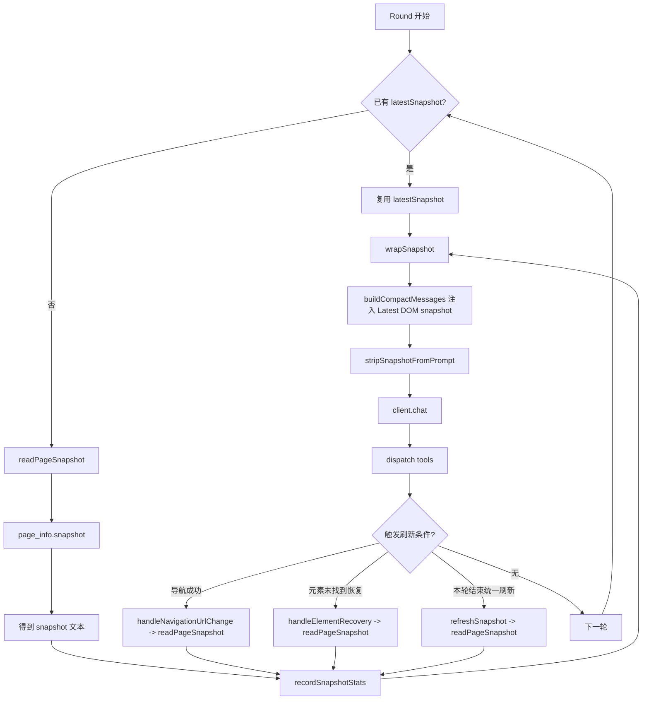

# AutoPilot 完整架构流程

> 从用户发送一条消息到 AI 完成任务，每一步都在这里。

---

## 一、60 秒结论

```
用户说话 → 拍快照 → 发给 AI
  → AI 看快照，把当前能做的子任务打包成工具调用
  → 执行工具，标记 ✅
  → 刷新快照（页面可能已变化）
  → 再发给 AI（带上 ✅ 已完成列表 + 新快照）
  → AI 推断剩余任务，继续做能做的
  → ... 重复 ...
  → 所有子任务都 ✅ → AI 返回文字总结 → 结束
```

**核心思想：任务被 AI 一口一口"吃掉"。** 每轮只消费当前页面上能做到的部分，做完后快照更新，再消费下一批，直到全部完成。

---

## 二、整体架构图

```
┌─────────────────────────────────────────────────────────┐
│                     WebAgent（入口）                      │
│   src/web/index.ts                                      │
│                                                         │
│   ┌───────────┐  ┌──────────────┐  ┌────────────────┐  │
│   │ AI Client │  │  Agent Loop  │  │   5 个 Web 工具  │  │
│   │ (fetch)   │  │  (决策循环)   │  │  (DOM/导航/...)  │  │
│   │ core/     │  │  core/       │  │  web/           │  │
│   └───────────┘  └──────────────┘  └────────────────┘  │
└─────────────────────────────────────────────────────────┘
         │                │                  │
         ▼                ▼                  ▼
    AI API 服务      循环控制逻辑        浏览器 DOM
 (OpenAI/Anthropic)  (快照/重试/防抖)    (点击/填写/读取)
```

---

## 三、完整对话流程（一步一步来）

### 第 1 步：用户调用 `agent.chat("帮我填写表单")`

```
文件：src/web/index.ts → WebAgent.chat()
```

发生了什么：

1. **创建 AI 客户端**
   - 有自定义 `client` → 直接用
   - 没有 → 调用 `createAIClient(config)` 根据 provider 创建
   - 支持 4 种：`openai` / `copilot` / `anthropic` / `deepseek`

2. **构建系统提示词**
   - 调用 `buildSystemPrompt({ tools })` 生成基础提示词
   - 或使用用户自定义的 `systemPrompt`

3. **生成初始 DOM 快照**（`autoSnapshot: true` 时）
   - 调用 `generateSnapshot(document.body, { maxDepth: 6, ... })`
   - 遍历 DOM 树，输出每个可见元素的标签、属性、文本
   - 每个元素生成一个 hash ID（如 `#a1b2c`），存入 `RefStore`
   - 快照追加到系统提示词尾部

4. **进入决策循环**
   - 调用 `executeAgentLoop({ client, registry, systemPrompt, message, ... })`

### 第 2 步：Agent Loop 决策循环（核心 — 任务增量消费）

```
文件：src/core/agent-loop/index.ts → executeAgentLoop()
```

这是整个系统的核心。**关键思想是：任务被 AI 一口一口"吃掉"。**

每一轮循环中，AI 做三件事：
1. **看**：读取当前快照，判断哪些子任务在当前页面上就能做
2. **做**：把能做的子任务一次性全部生成为工具调用
3. **更新**：工具执行完毕后，已完成的步骤标记 ✅，剩余任务留给下一轮

就像一个待办清单被逐步划掉：

```
原始任务："帮我在搜索框输入hello，点击搜索，然后打开第一个结果"
              ───────────────  ────────  ─────────────────

第 0 轮 AI 看快照 → 搜索框和搜索按钮都在 → 一次生成 2 个工具调用
  执行后：✅ 输入hello  ✅ 点击搜索  ⬜ 打开第一个结果
          ^^^^^^^^^^  ^^^^^^^^  （这两个被"吃掉"了）

第 1 轮 AI 看新快照 → 搜索结果已出现 → 生成 1 个工具调用
  执行后：✅ 输入hello  ✅ 点击搜索  ✅ 打开第一个结果
                                    ^^^^^^^^^^^^^^^^^（最后一个也被"吃掉"）

第 2 轮 AI 看到全部 ✅ → 不调工具，返回文字总结 → 循环结束
```

**任务永远不会回头，只会向前推进。** 每轮执行完后会刷新快照，AI 在新的页面状态上继续推进剩余任务。

完整循环流程：

```
          ┌─────────────────────────────────────────┐
          │          for (轮次 0 ~ maxRounds)        │
          │                                         │
          │  ① 确保有可用快照（没有就拍一张）          │
          │         ↓                               │
          │  ② 构建紧凑消息（从 trace 重建）          │
          │     包含：用户原始任务 + 已完成步骤摘要    │
          │          + 最新快照 + 执行策略指示        │
          │         ↓                               │
          │  ③ 调用 AI：client.chat(messages)       │
          │     AI 的决策过程：                       │
          │     a) 读取原始任务（完整目标）            │
          │     b) 读取已完成步骤（哪些已 ✅）         │
          │     c) 读取最新快照（当前页面状态）        │
          │     d) 推断：哪些剩余子任务现在能做？      │
          │     e) 生成：能做的全部打包为工具调用      │
          │         ↓                               │
          │  ④ AI 返回了什么？                       │
          │     ├─ 纯文本（全部 ✅）→ 结束循环 ✅     │
          │     ├─ dry-run 模式 → 打印不执行，结束    │
          │     └─ 有工具调用 → 继续 ↓               │
          │                                         │
          │  ⑤ 检测 URL 是否变化                     │
          │     └─ 变了 → 重置 RefStore + 拍新快照   │
          │                                         │
          │  ⑥ 批量执行所有工具调用                   │
          │     结果记录到 fullToolTrace              │
          │     （保护机制在此处生效，见第六节）       │
          │                                         │
          │  ⑦ 空转检测（连续只读2轮 → 强制终止）     │
          │                                         │
          │  ⑧ 刷新快照（页面可能已变化）             │
          │         ↓                               │
          │  ⑨ 回到 ① — AI 基于新快照推进剩余任务     │
          └─────────────────────────────────────────┘
```

### 第 3 步：每轮 AI 收到的消息结构

理解 AI 每轮"看到什么"很关键。紧凑消息结构如下：

```
┌─ [user] ──────────────────────────────────────────────────┐
│ "帮我在搜索框输入hello，点击搜索，然后打开第一个结果"         │
│  ↑ 始终保留完整的原始任务，AI 以此为终极目标                  │
└───────────────────────────────────────────────────────────┘

┌─ [assistant] ─────────────────────────────────────────────┐
│ Done steps (do NOT repeat):                               │
│   ✅ 1. dom(fill, #t4j8k) → ✓ 已填写 <input>             │
│   ✅ 2. dom(click, #u5n2m) → ✓ 已点击 <button>            │
│  ↑ 已完成的步骤清单 — AI 看到这些就知道不用再做              │
└───────────────────────────────────────────────────────────┘

┌─ [user] ──────────────────────────────────────────────────┐
│ ## Execution context                                      │
│ Master goal: 帮我在搜索框输入hello，点击搜索，打开第一个结果  │
│                                                           │
│ Already completed steps listed above. Do NOT repeat.      │
│ Infer remaining tasks and execute in this round.          │
│                                                           │
│ URL: https://example.com/search?q=hello                   │
│                                                           │
│ ## Latest DOM snapshot                                    │
│ [header] #k9f2a                                           │
│   [input] type="text" val="hello" #t4j8k                  │
│ [main] #r2a6d                                             │
│   [div] class="results" #x3m7p                            │
│     [a] "第一个搜索结果" href="/result/1" #y8n2q           │
│     [a] "第二个搜索结果" href="/result/2" #z1k5r           │
│  ↑ 最新快照 — AI 看到搜索结果已出现，可以点击                │
└───────────────────────────────────────────────────────────┘
```

AI 看到这三条消息后的推理过程：
1. 原始任务有 3 个子任务：输入hello、点击搜索、打开第一个结果
2. 前 2 个已经 ✅，不需要再做
3. 快照中第一个搜索结果 `#y8n2q` 已可见
4. → 生成 `dom.click(#y8n2q)` 工具调用

**这就是"任务被一步步吃掉"的机制。**

### 第 4 步：循环结束，返回结果

当 AI 判断原始任务的所有子部分都已 ✅，它不再返回工具调用，而是返回一段文字总结。循环退出。

```typescript
// 返回值
{
  reply: "已完成：搜索框输入了hello，点击了搜索按钮，并打开了第一个搜索结果。",
  toolCalls: [ ... ],      // 所有执行过的工具记录
  messages: [ ... ],       // 完整对话历史（用于多轮记忆）
}
```

---

## 四、DOM 快照机制

### 快照是什么？

快照就是把当前页面的 DOM 树"拍照"成一段文字，让 AI 能"看到"页面。

### 快照长什么样？

```
[header] #k9f2a
  [nav] #m3d7e
    [a] "首页" href="/" #p1c4b
    [a] "关于" href="/about" #q8e5f
[main] #r2a6d
  [h1] "欢迎使用" #s7g3h
  [input] type="text" placeholder="请输入姓名" #t4j8k
  [button] "提交" id="submit-btn" onclick #u5n2m
```

每个元素形如：`[标签] "文本内容" 关键属性 #hashID`

### Hash ID 是怎么来的？

```
DOM 路径 + 页面 URL → FNV-1a 哈希 → base36 编码 → 如 "a1b2c"
```

- `RefStore` 维护 `hash ID(string) → Element(DOM引用)` 的映射表
- 快照生成时写入映射（`refStore.set(el, path)` → 返回 hash ID）
- DOM 操作时读取映射（`refStore.get(id)` → 返回 Element）
- 每次 `chat()` 创建新的 `RefStore`，对话结束后清空

### 快照在哪些时机生成？

| 时机 | 触发位置 | 说明 |
|------|---------|------|
| **对话开始** | `WebAgent.chat()` | `autoSnapshot: true` 时，注入到 systemPrompt |
| **每轮循环开始** | `Agent Loop` | 没有可用快照时自动拍一张 |
| **URL 变化时** | `Agent Loop` | 检测到导航后自动拍新快照 |
| **元素未找到时** | `Agent Loop` | 自动恢复机制，刷新快照重新定位 |
| **每轮工具执行完后** | `Agent Loop` | 统一刷新，供下一轮直接使用 |
| **AI 主动请求** | `page_info.snapshot` | AI 觉得需要的时候 |

### 快照读取流程图



### 快照优化手段

| 优化 | 说明 | 默认值 |
|------|------|--------|
| **视口裁剪** | 只保留屏幕内可见元素 | `viewportOnly: true` |
| **智能剪枝** | 折叠无意义的纯布局 div/span；若同一折叠链路提升出多个相邻子节点，会输出括号分组块（`collapsed-group`）保留关联 | `pruneLayout: true` |
| **节点上限** | 超过后停止遍历 | `maxNodes: 220` |
| **子元素上限** | 每个父元素最多输出 N 个子元素 | `maxChildren: 25` |
| **文本截断** | 文本内容超长时截断 | `maxTextLength: 40` |
| **交互优先** | 先输出按钮/输入框等交互元素，再输出普通元素 | 始终开启 |

### 快照去重（防 token 爆炸）

多轮对话中快照会累积。Agent Loop 用标记对 `<!-- SNAPSHOT_START -->` / `<!-- SNAPSHOT_END -->` 包裹快照：

```
旧快照 → 替换为 "[此快照已过期，请参考对话中最新的快照]"
新快照 → 保留完整内容
```

---

## 五、消息压缩机制（支撑任务增量消费）

### 问题：为什么需要压缩？

传统做法是把每轮的 `assistant + tool result` 消息不断追加，导致 token 随轮次线性增长。
更关键的是，AI 需要清楚地知道"哪些做了、哪些没做"，才能正确地逐步消费任务。

### AutoPilot 的做法

**不累积消息对，每轮从 trace 重建紧凑消息！**

消息始终保持 3 条，内容每轮更新：

```
┌─ 第 1 条 [user] ─────────────────────────────────────────┐
│ 原始完整任务（永远不变，AI 以此为终极目标）                  │
│ "帮我输入hello，点击搜索，打开弹窗"                         │
└──────────────────────────────────────────────────────────┘

┌─ 第 2 条 [assistant] ────────────────────────────────────┐
│ Done steps (do NOT repeat):                              │
│   ✅ 1. dom(fill, #c1) → ✓ 已填写                       │ ← 已"吃掉"
│   ✅ 2. dom(click, #c2) → ✓ 已点击                      │ ← 已"吃掉"
│                                                          │
│ 每轮从 fullToolTrace 重建                                 │
│ AI 看到 ✅ 就知道这些不用再做                               │
└──────────────────────────────────────────────────────────┘

┌─ 第 3 条 [user] ─────────────────────────────────────────┐
│ ## Execution context                                     │
│ Master goal: 帮我输入hello，点击搜索，打开弹窗              │
│ 执行策略 + 是否有失败步骤的指示                             │
│                                                          │
│ URL: https://example.com/search?q=hello                  │
│                                                          │
│ ## Latest DOM snapshot（最新页面状态）                     │
│ [button] "打开详情" #g1   ← AI 从这里找到下一步该做什么    │
└──────────────────────────────────────────────────────────┘
```

**永远最多 `history.length + 3` 条消息**，无论循环了多少轮。

AI 对比"原始任务"和"已完成步骤"，自动推断出剩余要做的部分，再在最新快照中找目标元素——这就是任务被逐步消费的消息层面原理。

---

## 六、保护机制总览

### 1. 冗余快照防抖

AI 有时候会反复调用 `page_info.snapshot`，浪费时间和 token。

```
检测逻辑：
  已有可用快照 + AI 又请求 snapshot → 直接跳过，返回提示
  连续 ≥2 次 snapshot → 追加警告："Redundant snapshot detected"
```

### 2. 元素未找到自动恢复

DOM 操作失败（元素可能被动态更新了）时：

```
第 1 次失败 → 等待 100ms → 刷新快照 → 提示 AI 重新定位
第 2 次失败 → 等待 100ms → 刷新快照 → 提示 AI 重新定位
第 3 次失败 → 放弃，提示 "Max recovery reached, try different target"
```

### 3. 空转检测

AI 连续只调用只读工具（`page_info`）而不做实际操作：

```
连续 2 轮纯只读 → 强制终止循环，返回 "任务已完成"
```

### 4. URL 变化检测

每轮开始时检查 URL 是否变了（导航/跳转）：

```
URL 变了 → 重置 RefStore（旧 hash 失效）→ 拍新快照
```

导航类操作（`goto`/`back`/`forward`/`reload`）执行成功后也会额外检查。

### 5. 最大轮次限制

```
默认 maxRounds = 10
超过后循环强制退出
```

---

## 七、AI 客户端架构

### 类继承关系

```
BaseAIClient（custom.ts）
  │   可直接实例化（传 chatHandler）
  │   也可继承扩展
  │
  ├── OpenAIClient（openai.ts）
  │     用于 provider: "openai" / "copilot"
  │
  ├── AnthropicClient（anthropic.ts）
  │     用于 provider: "anthropic"
  │
  └── DeepSeekClient（deepseek.ts）
        用于 provider: "deepseek"
```

### 请求流向

```
WebAgent
  → createAIClient({ provider, model, apiKey, stream })
  → 根据 provider 创建对应 Client 实例
  → client.chat({ systemPrompt, messages, tools })
  → buildXxxRequest(config, params)    // 构建 HTTP 请求
  → fetch(url, { method, headers, body })
  → stream ? parseXxxStream(response)  // SSE 流式解析
          : parseXxxResponse(data)     // JSON 一次性解析
  → 返回统一的 AIChatResponse { text?, toolCalls?, usage? }
```

### SSE 流式解析

共享的 `consumeSSEJSON()` 函数（`src/core/ai-client/sse.ts`）：

```
SSE 流 → 逐行读取 → 按 event:/data: 规则组装 → 解析 JSON → 回调 onEvent
```

OpenAI 和 Anthropic 各自有 `parseXxxStream()` 函数，将流式 chunk 拼装为完整的 `AIChatResponse`。

---

## 八、五个内置工具

| 工具 | 文件 | 功能 |
|------|------|------|
| `dom` | `web/dom-tool.ts` | 点击、填写、键入、聚焦、悬停、按键、读属性、改属性、加/删 class |
| `navigate` | `web/navigate-tool.ts` | 跳转 URL、前进、后退、刷新、滚动 |
| `page_info` | `web/page-info-tool.ts` | 获取 URL/标题/选中文本/视口信息/DOM 快照/查询元素 |
| `wait` | `web/wait-tool.ts` | 等待元素出现/消失/文本出现 |
| `evaluate` | `web/evaluate-tool.ts` | 在页面上下文执行 JavaScript |

工具执行结果返回统一格式：

```typescript
{
  content: string | unknown,  // 结果内容
  details?: {                 // 可选的元信息
    error?: boolean,          // 是否失败
    code?: string,            // 错误代码（如 ELEMENT_NOT_FOUND）
    ...
  }
}
```

---

## 九、真实请求流程示例（任务被逐轮"吃掉"）

用户说：**"帮我在搜索框输入 hello，点击搜索按钮，然后打开弹窗"**

这个任务包含 3 个子任务。AI 不会一开始就知道弹窗在哪——它只能看到当前快照中存在的元素。所以任务会被分多轮逐步消费。

### 初始状态

```
当前页面快照（对话开始时 autoSnapshot 生成）：
  [header] #a1
    [h1] "示例网站" #a2
  [main] #b1
    [input] type="text" placeholder="搜索..." #c1      ← AI 能看到搜索框
    [button] "搜索" onclick #c2                         ← AI 能看到搜索按钮
    [div] class="content" #d1
      [p] "欢迎使用" #d2
                                                        ← 弹窗还不存在！
```

### 第 0 轮 — 吃掉前两个子任务

```
┌─── AI 收到的消息 ──────────────────────────────────────────┐
│                                                            │
│  [user] "帮我在搜索框输入 hello，点击搜索按钮，然后打开弹窗"  │
│                                                            │
│  （systemPrompt 末尾包含上面的 DOM 快照）                    │
└────────────────────────────────────────────────────────────┘

AI 的决策过程：
  1. 解析任务 → 3 个子任务：输入hello / 点击搜索 / 打开弹窗
  2. 看快照 → 搜索框 #c1 在 ✅ 搜索按钮 #c2 在 ✅ 弹窗 ❌ 不在
  3. 决定 → 先做能做的（输入 + 点击），弹窗等下一轮

┌─── AI 返回 ────────────────────────────────────────────────┐
│                                                            │
│  toolCalls: [                                              │
│    { dom, { action: "fill", selector: "#c1",               │
│             value: "hello" } },                            │
│    { dom, { action: "click", selector: "#c2" } }           │
│  ]                                                         │
│                                                            │
│  ↑ 一次返回 2 个工具调用 — 把当前能做的全部打包              │
└────────────────────────────────────────────────────────────┘

Agent Loop 执行工具：
  dom.fill(#c1, "hello")  → ✅ "已填写 <input>"
  dom.click(#c2)          → ✅ "已点击 <button>"

执行完毕 → 刷新快照（页面可能已变化）

任务消费进度：
  ✅ 输入hello  ✅ 点击搜索  ⬜ 打开弹窗
  ^^^^^^^^^^  ^^^^^^^^
  这两个已经被"吃掉"了
```

### 第 1 轮 — 页面变了，继续吃剩余任务

```
刷新后的快照（点击搜索后页面发生变化）：
  [header] #a1
    [h1] "示例网站" #a2
  [main] #b1
    [input] type="text" val="hello" #c1
    [button] "搜索" onclick #c2
    [div] class="results" #e1                           ← 新出现的搜索结果
      [a] "结果1" href="#" #e2
      [a] "结果2" href="#" #e3
    [dialog] class="popup" #f1                          ← 弹窗出现了！
      [h2] "搜索完成" #f2
      [button] "关闭" #f3

┌─── AI 收到的消息（紧凑格式）─────────────────────────────────┐
│                                                            │
│  [user] "帮我在搜索框输入 hello，点击搜索按钮，然后打开弹窗"  │
│                                                            │
│  [assistant] "Done steps (do NOT repeat):                  │
│    ✅ 1. dom(fill, #c1) → ✓ 已填写 <input>                │
│    ✅ 2. dom(click, #c2) → ✓ 已点击 <button>"              │
│         ↑ 前两步已完成，AI 知道不需要再做                     │
│                                                            │
│  [user] "## Execution context                              │
│    Master goal: 帮我在搜索框输入hello，点击搜索，打开弹窗     │
│    If goal is fully done, reply with summary.              │
│    URL: https://example.com/search?q=hello                 │
│    ## Latest DOM snapshot                                  │
│    [上面的新快照]"                                           │
│         ↑ 新快照中弹窗 #f1 已经可见了                        │
└────────────────────────────────────────────────────────────┘

AI 的决策过程：
  1. 原始任务 3 个子任务：输入hello / 点击搜索 / 打开弹窗
  2. 已完成 2 个（Done steps 里有 ✅✅）
  3. 剩余："打开弹窗" — 看快照 → 弹窗 dialog#f1 已经出现了
  4. 但弹窗已经是打开状态了（<dialog> 可见），任务其实已完成

┌─── AI 返回 ────────────────────────────────────────────────┐
│                                                            │
│  text: "已完成所有操作：在搜索框输入了 hello，                │
│         点击了搜索按钮，弹窗已自动打开。"                     │
│  toolCalls: []（空 — 不再调用任何工具）                      │
│                                                            │
│  ↑ AI 判断所有子任务都 ✅ → 返回纯文本总结 → 循环结束        │
└────────────────────────────────────────────────────────────┘

最终任务消费进度：
  ✅ 输入hello  ✅ 点击搜索  ✅ 打开弹窗（自动出现）
  全部被"吃掉" → 循环结束
```

### 如果弹窗需要手动打开呢？（多一轮的情况）

假设点击搜索后弹窗没有自动出现，但页面上出现了"打开详情"按钮：

```
第 1 轮新快照中：
  [button] "打开详情" #g1    ← 需要点击才能打开弹窗

AI 的决策：
  剩余任务是"打开弹窗"
  快照中有"打开详情"按钮 #g1 → 生成 dom.click(#g1)

执行后刷新快照 → 弹窗出现

第 2 轮：
  AI 看到 Done steps 有 3 个 ✅ → 返回文字总结 → 循环结束
```

**核心规律：AI 每轮只消费当前快照中"能做到的"子任务，做完后快照更新，再消费下一批。任务像队列一样被逐步清空。**

---

## 十、系统提示词详解（英文原文 + 中文注释）

以下是 `buildSystemPrompt()` 生成的完整提示词，逐条加上中文注释：

```text
You are AutoPilot, an AI agent controlling the user's web page via tools.
// 你是 AutoPilot，一个通过工具控制用户网页的 AI Agent。

## Rules

- Use `#hashID` from the snapshot as the `selector` param.
  Never guess CSS selectors.
  // 必须使用快照中的 #hashID 作为 selector 参数。
  // 禁止猜测 CSS 选择器。

- If the target is not in the snapshot, scroll or take a new snapshot first.
  // 如果目标元素不在快照中，先滚动页面或重新拍快照。

- Never repeat a step already marked ✅.
  Retry ❌ steps with a different approach.
  // 不要重复已经成功（✅）的步骤。
  // 对失败（❌）的步骤用不同方法重试。

- If a latest snapshot is already provided, do NOT call `page_info.snapshot`
  in the first actionable round unless required targets are truly missing.
  // 如果已经有最新快照，第一轮不要再调 snapshot，
  // 除非确实找不到目标元素。

- When returning tool calls, do not output step-by-step planning text.
  Keep text empty or one short sentence and execute directly.
  // 返回工具调用时不要输出长篇规划文字。
  // 保持文本为空或一句话，直接执行。

- Always treat the user's original request as the master goal.
  Infer remaining tasks from: (1) master goal, (2) done steps, (3) current snapshot.
  // 始终以用户原始请求为最终目标。
  // 从 (1) 目标 (2) 已完成步骤 (3) 当前快照 推断剩余任务。

- Decompose the goal into atomic steps, mark completed ones,
  then execute as many independent remaining steps as possible in THIS round.
  // 将目标分解为原子步骤，标记已完成的，
  // 然后在本轮尽可能多地执行独立的剩余步骤。

- Avoid one-tool-call rounds unless the next action strictly depends
  on a result not yet available.
  // 避免每轮只调一个工具，
  // 除非下一步确实依赖于尚未获取的结果。

- Prefer multi-call execution in one response, including dependent
  UI actions on the same page
  (e.g. click open-modal -> fill fields -> click submit).
  // 优先在一次响应中批量执行多个工具调用，
  // 包括同一页面上的连续 UI 操作
  //（如：打开对话框 → 填写字段 → 点击提交）。

- Do NOT request repeated `page_info.snapshot` if no navigation
  happened and no new uncertainty was introduced.
  // 如果没有发生页面导航，也没有新的不确定性，
  // 不要重复请求快照。

- If required targets are already present in the latest snapshot
  or known completed context, continue actions directly
  without extra inspection calls.
  // 如果目标元素已经在最新快照中，直接执行操作，
  // 不需要额外的检查调用。

- **Batch multiple tool calls in one round** when all targets are
  visible in the current snapshot.
  For example, filling 3 form fields = 3 tool calls in one response.
  // 当所有目标都在当前快照中可见时，一轮批量调用。
  // 例如：填写 3 个表单字段 = 一次响应中 3 个工具调用。

- **When the task is complete, reply with a short text summary.
  Do NOT call any more tools.**
  A task is complete when all the user's requested actions
  have been successfully performed (✅).
  // 任务完成后，只回复一段简短的文字总结，不再调工具。
  // 所有用户请求的操作都成功执行（✅）时即为完成。
```

### Agent Loop 中注入的 Execution Context 模板

每轮循环的 user 消息中还会注入以下上下文（`buildCompactMessages()` 生成）：

```text
## Execution context

Master goal (full original user request):
帮我填写表单
// 主目标（用户的完整原始请求）

Already completed steps are listed above as `Done steps (do NOT repeat)`.
// 已完成的步骤列在上方（不要重复执行）

Now infer remaining tasks from the master goal and execute
as many independent ones as possible in this round.
// 根据主目标推断剩余任务，在本轮尽可能多地执行独立任务。

Execution policy:
// 执行策略：

- Prefer batching multiple tool calls in one response.
  // 优先在一次响应中批量调用多个工具。

- Same-page dependent actions can be chained in one round
  (open -> fill -> submit).
  // 同一页面的连续操作可以在一轮中串联执行。

- Avoid redundant inspection. If latest snapshot already contains
  required targets, execute directly.
  // 避免多余的检查。如果最新快照已包含目标，直接执行。

- Do not call `page_info.snapshot` repeatedly unless page changed
  or target certainty is truly insufficient.
  // 不要重复调 snapshot，除非页面发生了变化。

- Workflow is: read latest snapshot -> execute a batch of tools
  -> read refreshed snapshot -> continue.
  // 工作流：读快照 → 批量执行 → 读新快照 → 继续。

// ─── 根据是否有失败步骤，追加不同的指示 ───

// 有失败时：
Continue from failures only. Batch all tool calls whose targets
are already visible in the snapshot. Do not repeat ✅ steps.
// 只从失败处继续。批量执行快照中可见目标的工具调用。不要重复成功步骤。

// 全部成功时：
If the goal is fully done, reply with a short summary (no tool calls).
Otherwise continue with only the remaining steps.
// 如果目标已完全完成，回复简短总结（不调工具）。
// 否则只继续剩余步骤。
```

### 工具错误恢复提示

```text
Recovery 1/2: snapshot refreshed, re-locate target.
// 恢复 1/2：快照已刷新，请重新定位目标元素。

Max recovery attempts (2) reached. Try a different target.
// 已达最大恢复次数（2次）。请尝试不同的目标。

Skip redundant snapshot: latest snapshot is already available for planning.
Execute actionable tools directly.
// 跳过冗余快照：已有最新快照可用。直接执行工具。

Redundant snapshot detected. Continue with remaining actionable steps
using the latest snapshot; avoid additional snapshot unless navigation
or uncertainty changes.
// 检测到冗余快照。使用最新快照继续剩余的操作步骤；
// 除非发生导航或不确定性变化，否则避免额外快照。
```

---

## 十一、关键配置参数速查

| 参数 | 默认值 | 源码位置 | 说明 |
|------|--------|---------|------|
| `maxRounds` | `10` | `agent-loop/constants.ts` | Agent 最大循环轮次 |
| `DEFAULT_RECOVERY_WAIT_MS` | `100` | `agent-loop/constants.ts` | 元素恢复前等待时间(ms) |
| `DEFAULT_ACTION_RECOVERY_ROUNDS` | `2` | `agent-loop/constants.ts` | 元素恢复最大重试次数 |
| `maxDepth` | `6` | `page-info-tool.ts` | 快照最大遍历深度 |
| `maxNodes` | `220` | `page-info-tool.ts` | 快照最大输出节点数 |
| `maxChildren` | `25` | `page-info-tool.ts` | 每个父节点最多子元素数 |
| `maxTextLength` | `40` | `page-info-tool.ts` | 每个节点文本截断长度 |
| `viewportOnly` | `true` | `page-info-tool.ts` | 只快照视口内元素 |
| `pruneLayout` | `true` | `page-info-tool.ts` | 智能剪枝空布局容器；多子节点提升时输出 `collapsed-group` 保留关联 |
| `temperature` | `0.3` | `openai.ts` | OpenAI 模型温度 |
| `max_tokens` | `4096` / `8192~16384` | 各客户端 | 最大输出 token |
| `stream` | `true` | `ai-client/index.ts` | 是否启用 SSE 流式 |
| `memory` | `false` | `web/index.ts` | 多轮对话记忆 |
| `autoSnapshot` | `true` | `web/index.ts` | 自动快照开关 |
| `DEFAULT_WAIT_MS` | `1000` | `dom-tool.ts` | DOM 操作前默认等待时间(ms) |

---

## 十二、错误处理汇总

| 层级 | 处理方式 | 是否阻断循环 |
|------|---------|:----------:|
| 工具 `execute()` 内部异常 | try-catch → 返回错误描述字符串 | ❌ |
| `ToolRegistry.dispatch()` | try-catch → `{ content: "Tool failed: ...", error: true }` | ❌ |
| 参数缺失 | 返回 `{ content: "缺少 xxx 参数" }` | ❌ |
| AI API 请求失败 | `res.ok` 检查 → 抛出 `Error("AI API {status}: ...")` | ✅ |
| 自动快照失败 | try-catch 静默忽略 | ❌ |
| SSE 读取超时 | 抛出 `Error("SSE read timeout")` | ✅ |

**核心设计原则：工具级别的错误不会中断 Agent 循环，AI 会收到错误信息后自行调整策略。只有 AI API 级别的错误才会中断整个流程。**

---

## 十三、文件定位表

| 职责 | 文件 |
|------|------|
| WebAgent 入口 | `src/web/index.ts` |
| Agent 决策循环 | `src/core/agent-loop/index.ts` |
| 循环辅助函数 | `src/core/agent-loop/helpers.ts` |
| 循环常量 | `src/core/agent-loop/constants.ts` |
| 系统提示词 | `src/core/system-prompt.ts` |
| AI 客户端工厂 | `src/core/ai-client/index.ts` |
| AI 基类 | `src/core/ai-client/custom.ts` |
| OpenAI 客户端 | `src/core/ai-client/openai.ts` |
| Anthropic 客户端 | `src/core/ai-client/anthropic.ts` |
| DeepSeek 客户端 | `src/core/ai-client/deepseek.ts` |
| SSE 解析 | `src/core/ai-client/sse.ts` |
| DOM 操作工具 | `src/web/dom-tool.ts` |
| 页面导航工具 | `src/web/navigate-tool.ts` |
| 页面信息/快照 | `src/web/page-info-tool.ts` |
| 等待元素工具 | `src/web/wait-tool.ts` |
| JS 执行工具 | `src/web/evaluate-tool.ts` |
| Hash ID 映射 | `src/web/ref-store.ts` |
| 工具注册表 | `src/core/tool-registry.ts` |
| 类型定义 | `src/core/types.ts` |
